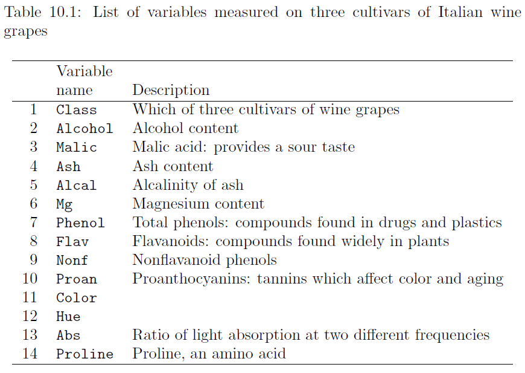
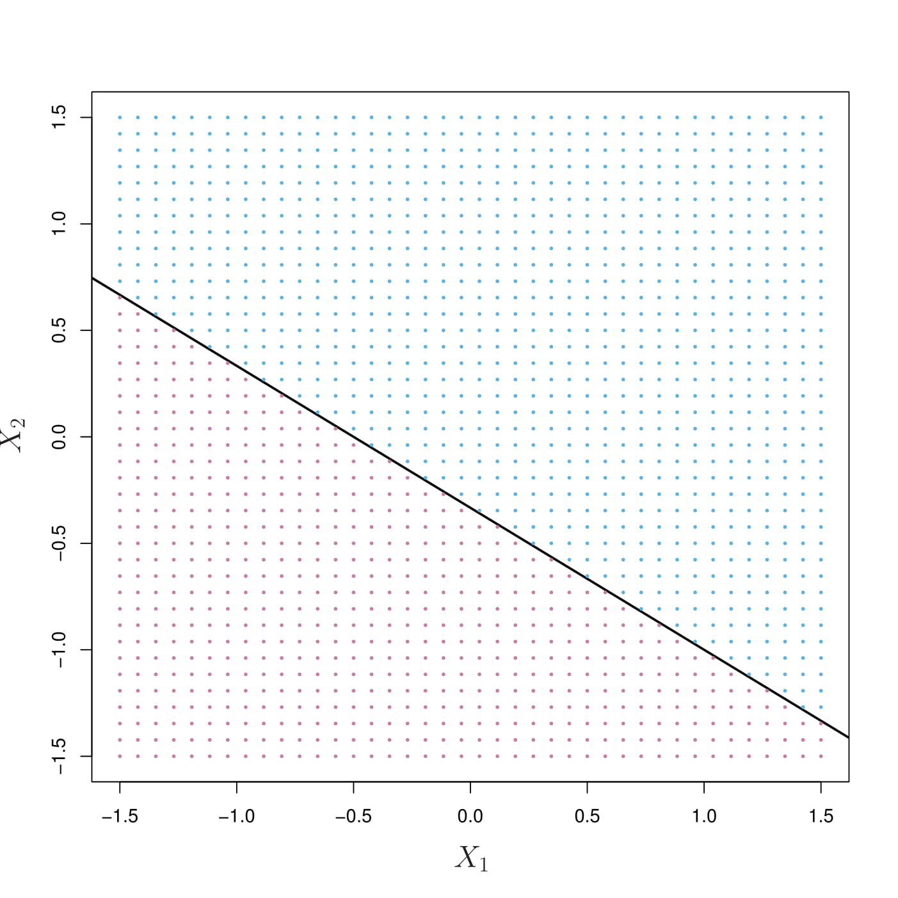
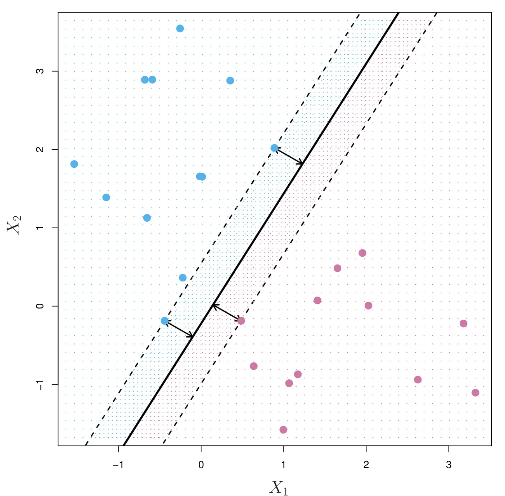
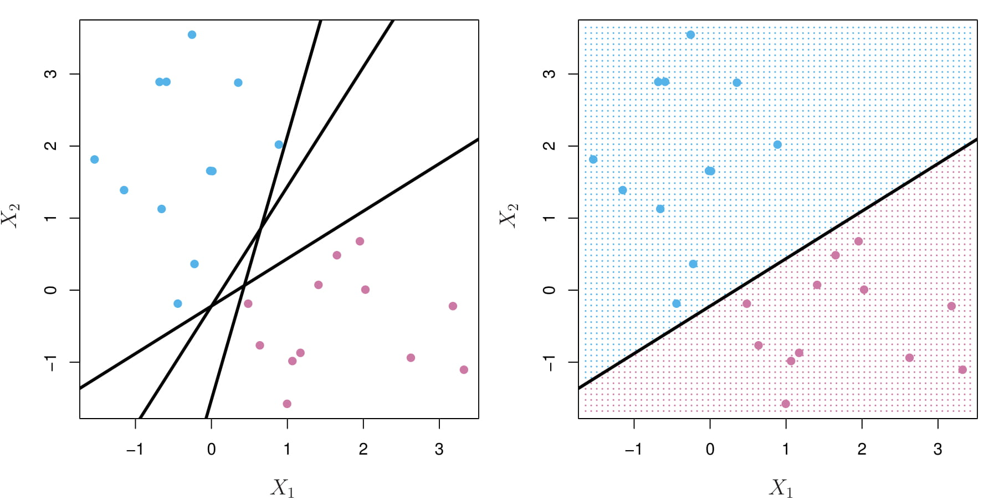
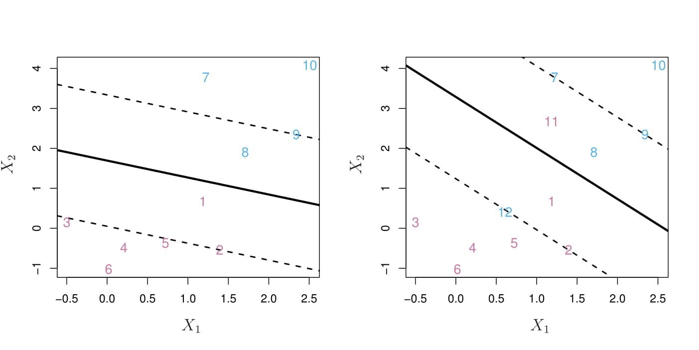
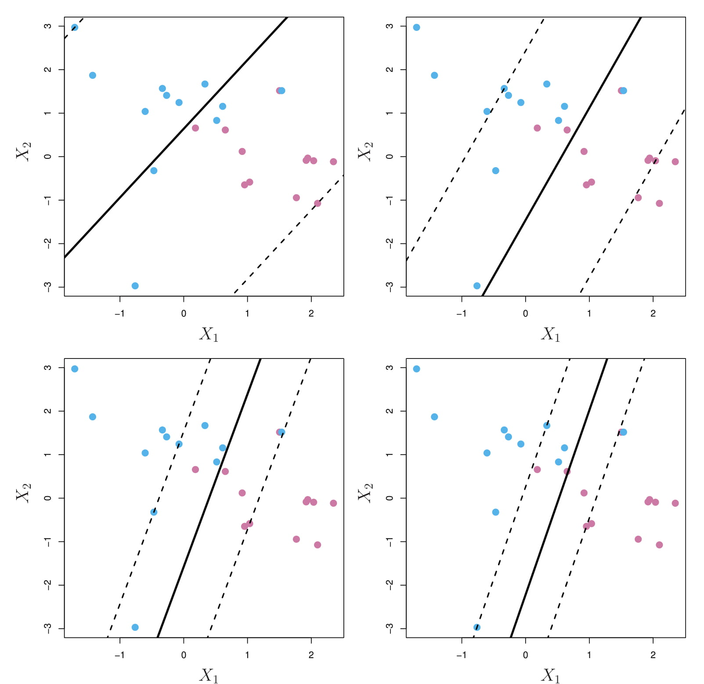
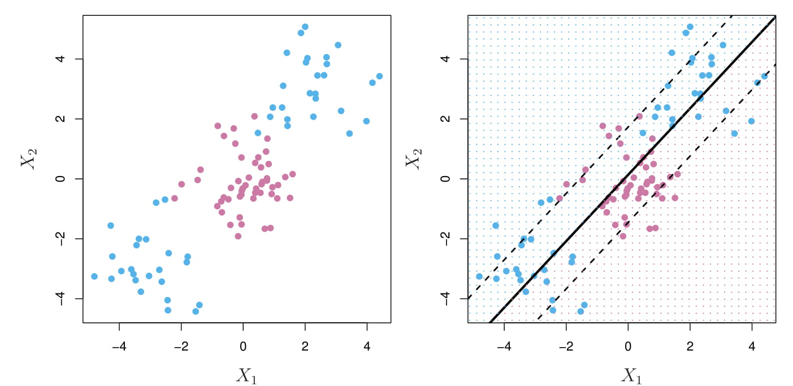
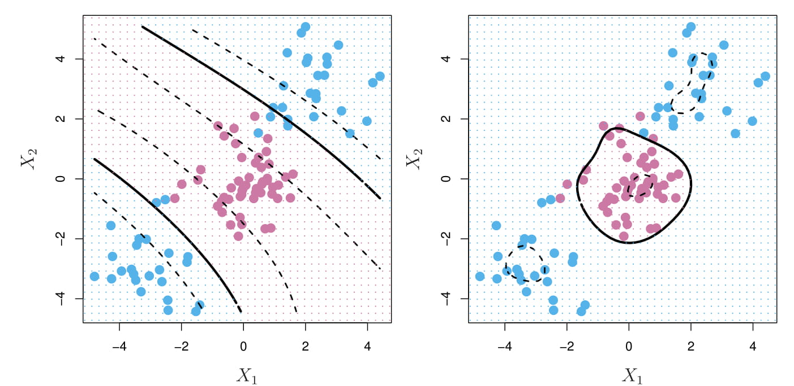

# Chapter 10: Discrimination and Classification

```{r, include=FALSE, cache=TRUE}
require(Matrix)
```

***

**Questions of interest**:

* If we have multivariate observations from two or more identified populations, how can we characterize them?
* Is there a combination of measurements that can be used to clearly distinguish between these groups?
* Is there a rule that can be used to optimally assign new observations to two or more labeled classes?

To think in **multivariate** terms, we do not use only one variable at a time to distinguish between groups of individuals, but, rather, we use **a combination of explanatory variables**.

PCA? The objectives of PCA are (1) data reduction and (2) interpretation, although we might use principle components to identify groups.

In discriminant analysis we begin by knowing the group membership, and then try to identify linear combinations of several variables that **can be used to distinguish between the groups**.

## 10.1 An Introductory Example

Data on **three varieties of wine cultivars** is given in the data set wines (Forina et al. 1988). There are 178 different wines examined. A list of the 14 variables in this data set are listed in Table 10.1:



```{r, cache=TRUE}
wines <- read.table("dataset/Wines.txt", header = TRUE)
head(wines)
```

```{r, cache=TRUE}
colors <- c("green", "red" ,"blue")[wines[ , 1]]

# The Class variable is jittered to make it easier to view.
# new dataframe with jittered Class variable
newwine <- cbind(jitter(as.integer(wines[ , 1])), wines[ , -1]) # jitter: Add a small amount of noise to a numeric vector
names(newwine)[1] <- names(wines)[1] # old name to new variable

pairs(newwine, pch = 16, cex = .3, gap = 0, col = colors, xaxt = "n", yaxt = "n")
```

In the top row and left column in the pairwise scatterplots above, we can identify **individual variables** that demonstrate how individual variables differ across the three groups of wines.

Specifically, we can perform a hypothesis test that the means of each of the variables are the same across the three groups. (**one-way ANOVA**)


```{r, cache=TRUE}
vars <- dim(wines)[2]          # number of variables
mn <- rep(0, 3)
for (i in 2 : vars)            # omit the first, Class variable
{
  z <- summary.aov(aov(wines[, i] ~ wines$Class))
  # print(z)
  p <- z[[1]]$"Pr(>F)"[1]    # capture the p-values
  # print(p)
  p <- max(p, .0001)
  for(j in 1 : 3)
  {
    mn[j] <- mean(wines[ wines$Class == j, i])
  }
  if(i == 2)univ <- c(p,mn)
  else univ <- rbind(univ, c(p, mn))
}

row.names(univ) <- colnames(wines)[2 : vars]
colnames(univ) <- c( "p-value", "Group=1", 
                     "Group=2", "Group=3")
print(univ, 4)

table(wines$Class)      # frequency table for each level
```

* We find that the one-way analysis of variance demonstrates an extreme
level of statistical significance for every variable except for the *Ash* variable in the data set.

* This marginal approach is intuitive for identifying **group means**, but it
fails to identify discriminatory characteristics for **individuals**. 

* One **individual** cultivar may have a high or low value for a specified measurement, but the histograms of the three groups may exhibit considerable **overlap**, making assessment of group membership difficult.This overlap is readily apparent in the following **parallel coordinate plot**:

```{r, cache=TRUE}
library(MASS)
parcoord(wines[, c(9, 11 : 14, 7, 8)], col = colors)
```

* The univariate approach fails to include correlations between the individual
measurements. There may be combinations of variables that provide a much higher level of discriminatory precision between the three cultivars than this univariate approach.

* Considering the correlations, a number of plotted pairs are useful in identifying and discriminating between the three cultivars in the aforementioned pairwise scatterplots. These include **(Abs, Proline)**, **(Alcohol, Hue)**, and **(Color, Flav)** as examples.

* The following two sections describe discriminatory methods based on **linear combinations of all variables** in this data set. The **support vector approach**, described in Section 10.4, identifies specific observations that help **define regions of high discriminatory value and do not necessarily seek linear combinations** to achieve these goals.

## 10.2 Multinomial Logistic Regression

### Two groups

* We use **logistic regression** to distinguish between two different groups. This classification criteria is based on a probabilistic statement about the group membership of each observation.

* Denote the group membership as a bivariate response variable, $Y = 0$ or $1$, conditional on a vector of explanatory variables $\vec x$.

* The observed data on the $i$-th observation: $(y_i, \vec x_i)$.

* The logistic regression model:

$$\log\Bigg(\dfrac{\Pr(Y=1|\vec x)}{\Pr(Y=0|\vec x)}\Bigg)=\vec \beta'\vec x$$

* By simple algebraic manipulation, we have

$$\Pr(Y=1|\vec x)=\dfrac{1}{1+e^{-\vec \beta'\vec x}}$$

* We can estimate the parameter vector *\vec \beta* using **maximum likelihood** and perform statistical inference on it.

### More than two groups

* The most commonly used approach selects one category as a **reference or baseline** and compares all other categories to it. 

* This approach performs a **pairwise comparison** between each of the categories to the single baseline, reference category. 

* This approach has a useful interpretation when there is an obvious baseline standard, and it makes sense that all categories should be compared to it. 

* In the case of the wine cultivar data, there is no obvious comparison group. We will set Class 2 as the reference, since Class 2 has the most observations among these three classes.

* The generalization of logistic regression to model the three categories for the wine data is the pair of simultaneous equations:

$$\log\Bigg(\dfrac{\Pr(\text{Class}=1|\vec x)}{\Pr(\text{Class}=2|\vec x)}\Bigg)=\vec \beta_1'\vec x$$
$$\log\Bigg(\dfrac{\Pr(\text{Class}=3|\vec x)}{\Pr(\text{Class}=2|\vec x)}\Bigg)=\vec \beta_3'\vec x$$

```{r, cache=TRUE}
library(nnet)
wines$Class <- as.factor(wines$Class) # create factor categories
wines$rClass <- relevel(wines$Class, ref = 2)  # set reference category 

winelogit <- multinom(rClass ~ Alcohol + Ash + Alcal + Abs  + Proline, 
                      data = wines, maxit = 200)

# These regression coefficients are the pairwise comparisons between Class=1 and =3 with the reference category. The fitted coefficients represent log-odds ratios of the change on classification probabilities when the independent variable changes by one unit. 
print(ws <- summary(winelogit), digits = 4)

tratio <- ws$coefficients / ws$standard.errors
# Compute two-tailed p values from the t with $edf = effective df
round(2 * (1 - pt(abs(tratio), df = ws$edf)), digits = 4)
# Each row is the true class membership and the estimated probability of class membership for this wine.
round(cbind(wines$Class,ws$fitted.values)[c(1:5, 101:105, 171:175), ], digits = 4)
```

### Graphical diagnostics

```{r, cache=TRUE}
colors <- c("green", "red", "blue")[wines$Class]
plot(winelogit$fitted.values[, 2 : 3], 
     col = colors, cex = 1.25, cex.lab=1.5,
     xlab = "Fitted  probability of  y=1",  
     ylab = "Fitted probability of y=3", main = "multinomial logistic")
text( rep(.42, 4), c(1, .92,  .84, .76), pos = rep(4, 4),
      col = c("black", "green", "red", "blue"),
      labels = c("Observation codes:", "y=1 category", 
                 "y=2 category (ref)", "y=3 category"))
lines( c(.4, .4, 1.2), c(1.2, .7, .7))

lines(c(0, 1), c(1, 0), lty = "dotted")
lines(c(0, 0), c(1, 0), lty = "dotted")
lines(c(1, 0), c(0, 0), lty = "dotted")
```

```{r, cache=TRUE}
nmlr <- function(fit, obs){ # normalized  multivariate logistic residuals
  nmlr <- matrix(0, nrow = dim(fit)[1], 
                 ncol = dim(fit)[2])  # initialize 
  for (i in 1 : (dim(fit)[1])){
    for (j in 1 : (dim(fit)[2])){
      p <- fit[i, j]              # fitted p parameter
      ob <- obs[i, j]
      res <- (ob - p)  /  (sqrt( p * (1 - p) ) )
      nmlr[i, j] <- res
    }
  }
  nmlr
}
###  Plot of standardized residuals
obs <- cbind(as.integer(wines$Class == 1),
             as.integer(wines$Class == 3))
colnames(obs) = c("1", "3")
res <- nmlr(winelogit$fitted.values[, 2 : 3], obs)
plot(res, col = colors, cex = 1.25,
     xlab = "Std residual for fitted probability of y=1",
     ylab = "Std residual for y=3")

```


## 10.3 Linear Discriminant Analysis

* Linear discrimination analysis allows us to identify a linear combination of variables that can be used to clearly identify the group membership of all individuals.

* linear discriminant analysis assumes that the vector of the explanatory variables $\vec x$ has multivariate normal distributions with different means for each group but the same covariance across all groups.

### Wine data example

* We apply the linear discrimination analysis to the wine data and plot the resulting groups in colors and identifying Class number.

```{r, cache=TRUE}
wines <- read.table("dataset/Wines.txt", header = TRUE)
colors <- c("green", "red", "blue")[wines$Class]
wines$Class <- as.factor(wines$Class) 

library(MASS)
ld <- lda(Class ~ ., data = wines)

# The first and second discriminators are linear combinations of variables that best discriminate between the three cultivars of wines. The linear weights are listed as LD1 and LD2 in the output:
ld

# The loadings are the linear combinations of the explanatory variables,
loading <- as.matrix(wines[, 2 : 14])  %*%   ld$scaling # ld$scaling: coefficients
head(loading)

# Thie following figure illustrates a clear distinction between the three cultivars.
plot(loading, col = colors, pch = 16, cex = 2,
     xlab = "First linear discriminator",
     ylab = "Second linear discriminator")
for (i in 1 : 3){       # add class number to each centroid
  centx <- mean(loading[wines[, 1] == i, ] [, 1] )
  centy <- mean(loading[wines[,1] == i, ] [, 2] )
  text(centx, centy, i, cex = 2)
}

# The fitted (posterior) estimated probabilities of group membership can be obtained as predict(ld)$posterior
ldp <- predict(ld)$posterior

# From the following plot, we can see the plot for LDA is much better than the corresponding one for the multinomial logistic regression (under stronger assumption, which needs to be checked before analysis!)
plot(ldp[, 1], ldp[, 3], col = colors, cex = 1.25,
     xlab = "Fitted probability of y=1", cex.lab=1.5,
     ylab = "Fitted probability of y=3", main = "LDA")
text( rep(.42, 4), c(1, .92,  .84, .76), pos = rep(4, 4),
      col = c("black", "green", "red", "blue"), cex=1.25,
      labels = c("Observation codes:", "y=1 category", 
                 "y=2 category (ref)", "y=3 category"))
lines( c(.4, .4, 1.2), c(1.2, .7, .7))

lines(c(0, 1), c(1, 0), lty = "dotted")
lines(c(0, 0), c(1, 0), lty = "dotted")
lines(c(1, 0), c(0, 0), lty = "dotted")
```

### Methodology

Suppose we have $K$ different populations (for some $K = 2, 3, \dots$) and each population is expressible as a $p$-dimensional normal population with respective means $\vec \mu_j$ ($j = 1,\dots,K$) and all with the same covariance matrix $\mathbf{\Sigma}$. 

$$\vec X \sim N_p(\vec \mu_j, \mathbf{\Sigma}), \vec X \text{ is from Population } j, j = 1,\dots,K$$


#### Prior probabilities:
* Let $\pi_j$ denote the probability that a randomly selected observation is sampled from Population $j$.

$$\Pr(\text{Population } j)=\pi_j$$

* The parameters $\pi_j$ are called **prior probabilities** because they represent characteristics of the population that are known to us before any data is observed.
* They can be **estimated from the data**, as is frequently the case in practice. In the wine data example, these prior probabilities are the observed sample proportions of the three wine cultivars.  

The means $\vec \mu_j$ and the covariance matrix $\mathbf{\Sigma}$ common to all populations will be assumed to be known, but, in practice, these will also be **estimated from the data**.

Given a $p$-dimensional observation $\vec x$, the **conditional density** function of $\vec x$ given that it was sampled from Population $j$ is
$$f(\vec x|\text{Population } j)=f(\vec x|\vec \mu_j, \mathbf{\Sigma})$$
for a multivariate normal density function with mean $\vec \mu_j$ and the covariance matrix $\mathbf{\Sigma}$.

The **joint density** of observing $\vec x$ from Population $j$ is
$$f(\vec x \text{ was sampled from Population } j ) = \pi_jf(\vec x|\vec \mu_j, \mathbf{\Sigma})$$

The **marginal density** for a value $\vec x$ sampled from an unspecified population:
$$f(\vec x) =\sum_{j=1}^K\pi_jf(\vec x|\vec \mu_j, \mathbf{\Sigma})$$
is the sum over all possible population values of $j = 1,\dots,K$.

The **posterior probability** of sampling from Population $k$ for a given observation $\vec x$ is
$$f(\text{Population } k| \vec x) = \dfrac{\pi_kf(\vec x|\vec \mu_k, \mathbf{\Sigma})}{\sum_{j=1}^K\pi_jf(\vec x|\vec \mu_j, \mathbf{\Sigma})}$$

The **maximum a posteriori (MAP) estimator** $\hat k$ directs us to choose the value of $k$ that makes the **posterior probability** as large as possible (also called the **Bayes classifier**.) Since the denominator is the same for every value of $k$ so the **MAP estimator** of $k$ is the value that maximizes the numerator.

$$\begin{aligned}
\hat k=&\underset{k}{argmax} \ \pi_kf(\vec x|\vec \mu_k, \mathbf{\Sigma})\\
=&\underset{k}{argmax} \ \log\{\pi_kf(\vec x|\vec \mu_k, \mathbf{\Sigma})\}\\
=&\underset{k}{argmax} \ \log(\pi_k)-\log\{(2\pi)^{p/2}|\mathbf{\Sigma}^{1/2}|\}-\dfrac{1}{2}(\vec x-\vec \mu_k)'\mathbf{\Sigma}^{-1}(\vec x-\vec \mu_k)\\
=&\underset{k}{argmax} \ \log(\pi_k)-\dfrac{1}{2}(\vec x-\vec \mu_k)'\mathbf{\Sigma}^{-1}(\vec x-\vec \mu_k)\\
=&\underset{k}{argmax} \ \log(\pi_k)-\dfrac{1}{2}\vec x'\mathbf{\Sigma}^{-1}\vec x-\dfrac{1}{2}\vec \mu_k'\mathbf{\Sigma}^{-1}\vec \mu_k+ \vec x'\mathbf{\Sigma}^{-1}\vec \mu_k\\
=&\underset{k}{argmax} \ \log(\pi_k)-\dfrac{1}{2}\vec \mu_k'\mathbf{\Sigma}^{-1}\vec \mu_k+ \vec x'\mathbf{\Sigma}^{-1}\vec \mu_k
\end{aligned}$$

Finally, the discriminant function for LDA, defined by
$$\delta_k(\vec x)=\log(\pi_k)-\dfrac{1}{2}\vec \mu_k'\mathbf{\Sigma}^{-1}\vec \mu_k+ \vec x'\mathbf{\Sigma}^{-1}\vec \mu_k$$
is a linear function of $\vec x$, leading us to use the name, **linear discrimination**. 

In practice, the parameters ($\mu_k, \mathbf{\Sigma}$) are replaced by their usual estimators (Lecture 6.)

How does the linear discrimination process distinguish between two different populations denoted $j$ and $k$?

The **boundary** of this process occurs for values of $\vec x$ for which $\delta_j(\vec x) = \delta_k(\vec x)$. That is, the solutions to this equation is a set of hypothetical data values $\vec x$ that would provide equal amounts of evidence for both of these different populations.

The solutions of the equation $\delta_j(\vec x) = \delta_k(\vec x)$ occur for values of $\vec x$ in
which
$$\log(\pi_k/\pi_j)-\dfrac{1}{2}(\vec \mu_k+\vec \mu_j)'\mathbf{\Sigma}^{-1}(\vec \mu_k-\vec \mu_j)+ \vec x'\mathbf{\Sigma}^{-1}(\vec \mu_k-\vec \mu_j)$$
or more simply,
Constant + x
$$\text{Constant }+ \vec x'\mathbf{\Sigma}^{-1}(\vec \mu_k-\vec \mu_j)$$
where the Constant depends on $j$ and $k$ but not on $\vec x$. Obviously, it is a linear boundary.

### An illustrative example (mixture of two normal distributions)

* Prior probabilities: $\pi_1=0.6, \pi_2=0.4$
* Popolation means and covariance matrix:

$$\mu_1=\begin{bmatrix}
-1\\
-1
\end{bmatrix}, 
\mu_2=\begin{bmatrix}
1\\
1
\end{bmatrix},
\mathbf{\Sigma}=\begin{bmatrix}
1 & -0.4\\
-0.4 & 1.2
\end{bmatrix}$$


```{r, cache=TRUE}
library(MVA)
library(mvtnorm)

pi1 <- .6        # prior probilities
pi2 <- .4
mu1 <- c(-1, -1) # mean vectors
mu2 <- c(1, 1)
cov <- matrix( c( 1, -.4, -.4, 1.2), 2, 2)

del <- .1      # how fine the grid
lim <- 3.2     # normals plotted on +/- lim
x <- seq(-lim, lim, del)
y <- x

# bivariate normal density for contours
corcon <- function(x, y, mu1, mu2, cov){
  nx <- length(x)
  ny <- length(y)
  z <- matrix(rep(0, nx * ny), nx, ny)  # build lattice
  for (i in 1 : nx){
    for (j in 1 : ny){
      xy <- c( x[i], y[j] )
      z[i,j] <- pi1 * dmvnorm(xy, mu1, cov) + 
        pi2 * dmvnorm(xy, mu2, cov)
    }
  }
  z
}
z <- corcon(x, y, mu1, mu2, cov) 

# contour plot
contour(x, y, z, drawlabels = FALSE, axes = FALSE, 
        frame = TRUE, col = "blue", lwd = 2)
# boundary
sinv <- solve(cov)
const <- log(pi1 / pi2) -.5 * (mu1 + mu2) %*% sinv %*% (mu1 - mu2)
line.coef <- sinv %*% (mu1 - mu2)
abline(a=-1/line.coef[2], b=-line.coef[1]/line.coef[2], col="red")

# perspective plot
# The front/left normal (with pi1 = 0.6) is a little taller than the second population with pi2 = 0.4. 
persp(x, y, z, r=1,
      axes = FALSE, xlab=" ", ylab=" ", box = FALSE, 
      col = "green", shade = .05)
```

#### Fisher linear discriminant function

Ignoring thr constant term in the boundary function, the Fisher linear discriminant function between populations $j$ and $k$ is
$$L_{jk}(x)=\vec x'\mathbf{S}^{-1}(\vec{\bar x}_k-\vec{\bar x}_j).$$

Population means $\mu_k$ are replaced by **the sampled within-group means**. The covariance matrix $\mathbf{\Sigma}$ is replaced by **the sample covariance matrix** $\mathbf{S}$ assuming that the covariance is the same in all groups. 

The fisher discriminator is a scalar-valued, linear function of a vector of data values, $\vec x$. More generally, when discriminating between $K$ groups, there will be (**at most**) $K-1$ linear discriminators. 

**In the wine data Example, there are two linear discriminators**.

### Quadratic Discriminant Analysis (QDA)

Unlike LDA, QDA assumes that each class has its own covariance matrix:
$$\vec X \sim N_p(\vec \mu_k, \mathbf{\Sigma}_k)$$

Under this assumption, the Bayes classifier assigns an observation $\vec X = \vec x$ to the class for which
$$\delta_k(\vec x)=\log(\pi_k) - \dfrac{1}{2}\log(|\mathbf{\Sigma_k}|)-\dfrac{1}{2}\vec x'\mathbf{\Sigma_k}^{-1}\vec x+ \vec x'\mathbf{\Sigma_k}^{-1}\vec \mu_k-\dfrac{1}{2}\vec \mu_k'\mathbf{\Sigma_k}^{-1}\vec \mu_k$$
is largest.

```{r, cache=TRUE}
wines <- read.table("dataset/Wines.txt", header = TRUE)
colors <- c("green", "red", "blue")[wines$Class]
wines$Class <- as.factor(wines$Class) 

library(MASS)
qd <- qda(Class ~ ., data = wines)
qdp <- predict(qd)$posterior

plot(qdp[, 1], qdp[, 3], col = colors, cex = 1.25,
     xlab = "Fitted probability of y=1", cex.lab=1.5,
     ylab = "Fitted probability of y=3", main = "QDA")
text( rep(.42, 4), c(1, .92,  .84, .76), pos = rep(4, 4),
      col = c("black", "green", "red", "blue"), cex=1.25,
      labels = c("Observation codes:", "y=1 category", 
                 "y=2 category (ref)", "y=3 category"))
lines( c(.4, .4, 1.2), c(1.2, .7, .7))

lines(c(0, 1), c(1, 0), lty = "dotted")
lines(c(0, 0), c(1, 0), lty = "dotted")
lines(c(1, 0), c(0, 0), lty = "dotted")
```

## 10.4 Support Vector Machine

The support vector machine (SVM) is a group of classification algorithms that
include a variety of parametric and nonparametric models:
* Parametric models include straight lines and similar regression methods. 
* The nonparametric methods contain a variety of kernel smoothing techniques.

The programs in R include features that estimate the classification probabilities using **cross validation** as well as **training samples** in machine learning.

### Example (linear SVM classifier)

```{r, cache=TRUE}
library(kernlab)
svmex <- read.table(file = "dataset/svmex.txt", header = TRUE, 
                    row.names = 1) # artifical data
svmex <- svmex[svmex[, 1] > -2, ]  # omit outlier
type <- 1 + (svmex[, 1] + svmex[, 2] > 0)      # known types
plot(svmex[, 1 : 2], pch = 16, cex = 1.75,
     col = c("red", "blue")[type], xlab = " ", 
     ylab = " ", xaxt = "n", yaxt = "n")

# line A: does not discriminate completely
lines(c(-.5,.5), c(-2.5, 3.25), type = "l", 
      col = "blue") 
text(.25, 2.5, label = "A", cex = 1.2)

# line B: is not maximum margins
lines(c(-.5, .5), c(3.25, -2.5), type = "l", col = "blue")
text(-.5, 2.5, labels = "B")

sv <- ksvm(type ~ . , data = svmex, type = "C-svc", 
           prob.model = TRUE)
# Extract a and b from the model	
a <- colSums(coef(sv)[[1]] * svmex[SVindex(sv), ])
b <- b(sv)
abline( b / a[1],  -a[2] / a[1], 
        col = "blue") # maximum margin line
text(-1.4, 1.7, labels = "C")
abline( (b + 6.9) / a[1], -a[2] / a[1], lty = 2) # upper margin
abline( (b - 6.9) / a[1], -a[2] / a[1], lty = 2) # lower margin

# circle the support vectors
ai <- alphaindex(sv)[[1]]    # indices for support vectors
points(svmex[ai, ], pch = 1, cex = 2.00)   # three thick circles
points(svmex[ai, ], pch = 1, cex = 2.25)
points(svmex[ai, ], pch = 1, cex = 2.50)
```

* Line A does not completely classify the red and blue groups of samples. 
* Line B classifies correctly but has small margins for misclassification. 
* Line C, the product of a SVM, provides the largest possible **margins**. These margins are given with dotted lines.

**Support vectors**:
(1) observations that are closest to the margins are most important to the determination of the classification regions
(2) observations that define and lie on the periphery of the regions of different colored points

### Example (kernel SVM classifier)

```{r, cache=TRUE}
library(kernlab)
library(mvtnorm)
set.seed(123)
x <- rmvnorm(n = 250, mean = c(0, 0), 
             sigma = matrix(c(1, .1, .1, 1), 2 , 2))
wavy <- sin(pi * x[, 1]) / 2               # wavy boundary
include <- (abs( wavy - x[, 2]) > .25 )# 2x width of boundary
x <- x[include, ]                      # include those inside 
wavy <- wavy[include]                 #    the wavy boundary
group <- 1 + (x[, 2] > wavy)          # above or below boundary?
all <- data.frame(x = x[, c(2, 1)], 
                  group = group)                     # build a data.frame
colnames(all) <- c("x2", "x1", "group")

sv <- ksvm(group ~ . , data = all, type = "C-svc")

x1.lim <- range(all$x1)
x2.lim <- range(all$x2)
plot(sv, data = all, xlim = x1.lim, ylim = x2.lim)

```

* **Kernel smoothing** makes **no assumption** on the shape of the regions. A functional form for the boundary between these two regions is not specified, but the SVM program clearly locates it.

* The kernel smooth produced by SVM classifies future observations with **confidence** based on the intensity of the plotted color. The lighter-colored regions have low confidence and white represents complete indifference, as in the wavy region across the center. 

* The groups above and below the sine wave are plotted as **circles** and **triangles**, respectively. Those observations are identified as **support vectors**. These are critical to **estimating the boundaries** plotted in solid.

### Cross Validation

* Cross Validation is a method of testing the accuracy of a classification model

* How well does the model correctly classify some future observations that were not part of the model building process?

* An **$K$-fold cross validation** randomly partitions a data set into $K$ nearly equally sized sets. (Typically, $K$ is an integer in the range between 5 and 10.) 
- One set, called **the testing data set**, is omitted. 
- The model is fitted using the remaining $K-1$ sets, which are referred to as **the training data set**.
- Once the training data set is fitted, cross validation examines how well the resulting model classifies the observations in the omitted, testing data set.
- The cross-validation process then systematically replaces the omitted
data and removes a different set. This process is **repeated**, separately fitting
and testing $K$ different models.

* The process of cross validation produces an estimate of the accuracy of the model but also has a hidden benefit, referred to as **machine learning**. In the process of producing an $K$-fold estimate of the classification error, the SVC (support vector classifier) also had to fit $K$ different models. Some of these models may have better properties than the original model fitted from the entire data. In this manner, the SVM appears to learn about better models.

### Application to the wine data

```{r, cache=TRUE}
wines <- read.table("dataset/Wines.txt", header = TRUE)
levels(wines$Class) <- 1 : 3     # grouping variable
class(wines$Class) <- "factor"   # classify the variable type
colors <- c("green", "red"," blue")[wines$Class]

svw <- ksvm(Class ~ . , data = wines, type = "C-svc", 
            prob.model = T)

# The alphaindex() command produces three separate lists of support vectors: one for each of the three cultivars. There may be some duplication when support vectors are on the boundary for more than one of the three group.
svi <- ( c(alphaindex(svw)[[1]], alphaindex(svw)[[2]], 
           alphaindex(svw)[[3]]))   # list of all support vectors
svi <- svi[ !duplicated(svi)]    # remove duplicates

svwine <- wines[svi, ]           # subset support vectors
svwine[, 1] <- jitter(as.integer(svwine[, 1])) # jitter Class
svcol <- colors[svi]             # and their colors

pairs(svwine, pch = 16, cex = .3, gap = 0, col = svcol, 
      xaxt = "n", yaxt = "n") # 69 observations out of 178 are support vectors

# 5-fold CV
(svw.CV <- ksvm(Class ~ . , data = wines, 
                type = "C-svc", cross = 5))

# prob.model = T: produce estimated multinomial prediction probabilities of individual observations belonging to each of the different groups.
print(predict(svw, wines[, -1], 
              type = "probabilities"), digits = 2)

# Plot fitted probabilities and residuals

# Fitted probabilities:
prob <- predict(svw, wines[, -1], type = "probabilities")

plot(prob[, 1], prob[, 3], col = colors, cex = 1.25, cex.lab = 1.5,
     xlab = "Fitted  probability of  y=1",  
     ylab = "Fitted probability of y=3", main="SVM")
text( rep(.42, 4), c(1, .92,  .84, .76), pos = rep(4, 4),
      col = c("black", "green", "red", "blue"),
      labels = c("Observation codes:", "y=1 category", 
                 "y=2 category (ref)", "y=3 category"))
lines( c(.4, .4, 1.2), c(1.2, .7, .7))  #  box around the text

lines(c(0, 1), c(1, 0), lty = "dotted")
lines(c(0, 0), c(1, 0), lty = "dotted")
lines(c(1, 0), c(0, 0), lty = "dotted")

# Residual plot

nmlr <- function(fit, obs){ # normalized  multivariate logistic residuals
  nmlr <- matrix(0,nrow = dim(fit)[1], ncol = dim(fit)[2])  
  for (i in 1 : (dim(fit)[1])){
    for (j in 1 : (dim(fit)[2])){
      p <- fit[i, j]            # fitted p parameter
      ob <- obs[i, j]
      res <- (ob - p)  /  (sqrt( p * (1 - p) ) )
      nmlr[i, j] <- res
    }
  }
  return(nmlr)
}

obs <- cbind(as.integer(wines$Class == 1),
             as.integer(wines$Class == 3))
colnames(obs) = c("1", "3")
res <- nmlr(prob[, 2 : 3], obs)
plot(res, col = colors, cex = 1.25,
     xlab = "Std residual for fitted probability of y=1",
     ylab = "Std residual for y=3")

```

The residual plot is not useful and exhibits a distorted horizontal scale, owing to the small probabilities involved.

**Pros**:
* extremely flexible
* able to detect the wavy boundary without any additional specification
* there are many options and different kernel smoothing functions available for SVM method.

**Cons**:
* SVM produces estimates but no model that can be expressed as a mathematical formula.

### Maximal Margin Classifier

The support vector machine is a generalization of a simple and intuitive classifier called the **maximal margin classifier**.

#### What Is a Hyperplane?

In a $p$-dimensional space, a **hyperplane** is a flat subspace of dimension $p-1$.

In two dimensions, a hyperplane is a line, defined by the equation
$$\beta_0+\beta_1X_1+\beta_2X_2=0$$

A hyperplane for a $p$-dimensional space:
$$\beta_0+\beta_1X_1+\beta_2X_2+\cdots+\beta_pX_p=0$$

If a point $\vec X =(X_1,X_2,\cdots , X_p)^T$ in $p$-dimensional space (i.e. a vector of length $p$) satisfies
$\beta_0+\beta_1X_1+\beta_2X_2+\cdots+\beta_pX_p=0$, then $\vec X$ lies on the hyperplane.

If a point $\vec X =(X_1,X_2,\cdots , X_p)^T$ satisfies $\beta_0+\beta_1X_1+\beta_2X_2+\cdots+\beta_pX_p<0$, then $\vec X$ lies to one side of the hyperplane.

On the other hand, if a point $\vec X =(X_1,X_2,\cdots, X_p)^T$ satisfies $\beta_0+\beta_1X_1+\beta_2X_2+\cdots+\beta_pX_p>0$, then $\vec X$ lies on the other side of the hyperplane.




* Solid line: $1+2X_1+3X_2=0$
* Blue: $1+2X_1+3X_2>0$
* Purple: $1+2X_1+3X_2<0$

#### Classification Using a Separating Hyperplane

Now suppose that we have a $n\times p$ data matrix $\mathbf{X}=\{x_{ij}, i=1,2,\dots,n,j=1,2,\dots,p\}$ that consists of $n$ training observations in $p$-dimensional space, and that these observations fall into two classes-that is, $y_1,\dots, y_n \in \{-1, 1\}$ where $-1$ represents one class and $1$ the other class.

A **separating hyperplane** has the property that
$$\beta_0+\beta_1x_{i1}+\beta_2x_{i2}+\cdots+\beta_px_{ip}>0 \text{ if } y_i=1$$
and
$$\beta_0+\beta_1x_{i1}+\beta_2x_{i2}+\cdots+\beta_px_{ip}<0 \text{ if } y_i=-1.$$
Equivalently, a separating hyperplane has the property that
$$y_i(\beta_0+\beta_1x_{i1}+\beta_2x_{i2}+\cdots+\beta_px_{ip})>0$$
for all $i=1,\dots,n.$

#### The Maximal Margin Classifier

We can compute the (perpendicular) distance from each training observation to a given separating hyperplane; the smallest such distance is the minimal distance from the observations to the hyperplane, and is known as the **margin**.

The **maximal margin hyperplane** (also known as the **optimal separating hyperplane**), which is the separating hyperplane that is farthest from the training observations (the margin is the largest). This is known as the **maximal margin classifier**.





#### Construction of the Maximal Margin Classifier

The **maximal margin hyperplane** is the solution to the **optimization** problem

$$
\begin{aligned}
& \underset{\beta_0,\dots,\beta_p}{\text{maximize}}M\\
& \text{subject to } \sum_{j=1}^p \beta_j^2=1,\\
& y_i(\beta_0+\beta_1x_{i1}+\beta_2x_{i2}+\cdots+\beta_px_{ip}) \ge M, \forall i=1,2,\dots,n
\end{aligned}
$$

Note that, under $\sum_{j=1}^p \beta_j^2=1$, the perpendicular distance from the $i$th observation to the hyperplane is given by
$$\dfrac{y_i(\beta_0+\beta_1x_{i1}+\beta_2x_{i2}+\cdots+\beta_px_{ip})}{\sqrt{y_i^2\sum_{j=1}^p \beta_j^2}}=y_i(\beta_0+\beta_1x_{i1}+\beta_2x_{i2}+\cdots+\beta_px_{ip}).$$

Hence, $M$ represents the margin of the hyperplane. This is exactly the definition of the maximal margin hyperplane!


### Support Vector Classifier

#### A non-separable case
We cannot use a separating hyperplane to exactly separate the two classes:



The **support vector classifier** is an extension of the maximal margin classifier to the non-separable case.


#### Details of the Support Vector Classifier
The **support vector classifier**, sometimes called a **soft margin classifier**. 

Rather than seeking the largest possible margin so that every observation is not only on the correct side of the hyperplane but also on the correct side of the margin, we instead allow some observations to be on the incorrect side of the margin, or even the incorrect side of the hyperplane. (**The margin is soft because it can be violated by some of the training observations**.)



It is the solution to the optimization problem
$$
\begin{aligned}
& \underset{\beta_0,\dots,\beta_p,\epsilon_1,\dots,\epsilon_n}{\text{maximize}}M\\
& \text{subject to } \sum_{j=1}^p \beta_j^2=1,\\
& y_i(\beta_0+\beta_1x_{i1}+\beta_2x_{i2}+\cdots+\beta_px_{ip}) \ge M(1-\epsilon_i)\\
& \epsilon_i\ge0, \sum_{i=1}^n\epsilon_i\le C
\end{aligned}
$$

(1) $C$ is a nonnegative tuning parameter
(2) $M$ is the width of the margin; we seek to make this quantity as large as possible.
(3) $\epsilon_1,\dots,\epsilon_p$ are **slack variables** that allow individual observations to be on the wrong side of the margin or the hyperplane

##### slack variable 
The slack variable $\epsilon_i$ tells us where the $i$th observation is located, relative to the hyperplane and relative to the margin:
(1) $\epsilon_i=0$: the $i$th observation is on the correct side of the margin
(2) $\epsilon_i>0$: the $i$th observation is on the wrong side of the margin
(3) $\epsilon_i>1$: the $i$th observation is on the wrong side of the hyperplane

##### Tuning parameter
The tuning parameter $C$ bounds $\sum_{i=1}^n\epsilon_i$, and so it determines the number and severity of the violations to the margin (and to the hyperplane) that we will tolerate.

We can think of $C$ as a **budget** for the amount that the margin can be violated by the n observations.

A support vector classifier was fit using four different values of the tuning parameter $C$



### Support Vectot Machine

**Support vector machine** is a further extension of the support vector classifier in order to accommodate **non-linear class boundaries**.

We first discuss a general mechanism for converting a linear classifier into one that produces non-linear decision boundaries. We then introduce the support vector machine, which does this in an **automatic** way.

#### Classification with Non-linear Decision Boundaries

In practice, we are sometimes faced with non-linear class boundaries.



In the right panel, the **support vector classifier** seeks a **linear** boundary, and consequently performs very **poorly**.

We could address the problem of possibly non-linear boundaries between classes by enlarging the feature space using quadratic, cubic, and even higher-order polynomial functions of the predictors.

For instance, rather than fitting a support vector classifier using $p$ features
$$X_1,X_2, \dots, X_p,$$
we could instead fit a support vector classifier using $2p$ features
$$X_1,X_1^2,X_2,X_2^2, \dots, X_p,X_p^2.$$

A non-linear decision boundary is led by solving the following optimization problem
$$
\begin{aligned}
& \underset{\beta_0,\beta_{11},\beta_{12},\dots,\beta_{p1},\beta_{p2},\epsilon_1,\dots,\epsilon_n}{\text{maximize}}M\\
& \text{subject to } \sum_{j=1}^p \sum_{k=1}^2\beta_{jk}^2=1,\\
& y_i(\beta_0+\sum_{j=1}^p\beta_{j1}x_{ij}+\sum_{j=1}^p\beta_{j2}x_{ij}^2) \ge M(1-\epsilon_i)\\
& \epsilon_i\ge0, \sum_{i=1}^n\epsilon_i\le C
\end{aligned}
$$

#### Details of the Support Vector Machine
The **support vector machine (SVM)** is an extension of the support vector classifier that results from **enlarging the feature space** in a specific way, using **kernels**.

The kernel approach that we describe here is simply an efficient computational approach for enlarging the feature space.

Let $\vec \beta=(\beta_1,\dots,\beta_p)', \vec x_i=(x_{i1},\dots, x_{ip})'$. Then, the support vector classifier problem is:
$$
\begin{aligned}
& \underset{\beta_0,\dots,\beta_p,\epsilon_1,\dots,\epsilon_n}{\text{maximize}}M\\
& \text{subject to } ||\vec \beta||=\sqrt{\vec \beta'\vec \beta}=1,\\
& y_i(\beta_0+\vec x_i'\vec\beta) \ge M(1-\epsilon_i)\\
& \epsilon_i\ge0, \sum_{i=1}^n\epsilon_i\le C
\end{aligned}
$$

Or equivalently (by setting $||\vec \beta||=1/M$),
$$
\begin{aligned}
& \underset{\beta_0,\vec \beta,\epsilon_1,\dots,\epsilon_n}{\text{minimize}}\dfrac{1}{2}||\vec \beta||^2+C\sum_{i=1}^n\epsilon_i\\
& \text{subject to } y_i(\beta_0+\vec x_i'\vec\beta) \ge 1-\epsilon_i, \epsilon_i\ge0
\end{aligned}
$$

where $C$ controls the tradeoff between maximum margin and loss.

It is a convex optimization problem, which has a quadratic programming solution using Lagrange multipliers.

The Lagrange (primal) function:
$$L_P=\dfrac{1}{2}||\vec \beta||^2+C\sum_{i=1}^n\epsilon_i-\sum_{i=1}^n\alpha_i[y_i(\beta_0+\vec x_i'\vec\beta) - (1-\epsilon_i)]-\sum_{i=1}^n\mu_i\epsilon_i$$

Taking the derivatives with respect to $\beta_0, \vec \beta, \epsilon_i$ and setting them to zeo, we get the Karush-Kuhn-Tucker (KKT) condition 1:
$$
\begin{aligned}
&\vec \beta=\sum_{i=1}^n\alpha_iy_ix_i,\\
&0=\sum_{i=1}^n\alpha_iy_i,\\
&\alpha_i=C-\mu_i,\forall i
\end{aligned}
$$


The Lagrange (Wolfe) dual objective function:
$$L_D=\sum_{i=1}^n\alpha_i-\dfrac{1}{2}\sum_{i=1}^n\sum_{j=1}^n\alpha_i\alpha_jy_iy_j\vec x_i' \vec x_j$$
which gives a lower bound on the objective function for any feasible point.

Then, we maximize $L_D$ subject to KKT condition 1, 2, and 3 (http://mypages.iit.edu/~jwang134/posts/KKT-SVs-SVM.html) to get the unique solution.

From $\vec \beta=\sum_{i=1}^n\alpha_iy_ix_i$, we can represent the linear support vector classifier as

$$f(\vec x)=\beta_0+\vec x_i'\vec\beta=\beta_0+\sum_{i=1}^n\alpha_iy_i<\vec x, \vec x_i>$$

#### The property of $\alpha_i$

* The observations with $\alpha_i=0$ do not contribute to the calculation of $\vec \beta$.
* The observations with $\alpha_i\ne 0$ are called the support vectors.
* If the slack variable $\epsilon_i>0$, $\alpha_i = C$

#### Kernel (enlarge the feature space)

We introduce a "bi-vector" function (**kernel function $K(\vec x, \vec x_i)$**) to generalize the inner product. Then, we can represent the classifier as
$$f(\vec x)=\beta_0+\sum_{i=1}^n\alpha_iy_iK(\vec x, \vec x_i)$$

Three popular choices for K in the SVM literature are

* $d$th-Degree polynomial: $K(\vec x, \vec x_i)=(1+<\vec x, \vec x_i>)^d$,
* (Gaussian) Radial basis: $K(\vec x, \vec x_i)=\exp(-\gamma||\vec x-\vec x_i||^2)$
* Neural network: $K(\vec x, \vec x_i)=\tanh(\kappa_1<\vec x, \vec x_i>+\kappa_2)$



* Left: An SVM with a polynomial kernel of degree 3 is applied to the non-linear data. 
* Right: An SVM with a radial kernel is applied. 
* Solid line: SVM
* Dashed line: margins of the SVM

In this example, either kernel is capable of capturing the decision boundary.


#### SVMs with More than Two Classes ($K>2$ classes)

##### One-Versus-One Classification

A **one-versus-one** or **all-pairs** approach constructs **${K \choose 2}$** SVMs, each of which compares a pair of classes.

##### One-Versus-All Classification

The **one-versus-all** approach is an alternative procedure for applying SVMs one-versusin the case of $K > 2$ classes. We fit **$K$** SVMs, each time comparing one of all the $K$ classes to the remaining $K-1$ classes.


### Lab: Support Vector Machines

In the textbook "Introduction to statistical learning", they use the **e1071** library in R to demonstrate the support vector classifier and the SVM.


**kernlab** versus **e1071**
https://www.thekerneltrip.com/statistics/kernlab-vs-e1071/

#### Support Vector Classifier

```{r, cache=TRUE}
## generate the data
set.seed(1)
x=matrix(rnorm(20*2), ncol=2)
y=c(rep(-1,10), rep(1,10))
x[y==1,]=x[y==1,] + 1
plot(x, col=(3-y))

# combine x and y into a data frame
dat=data.frame(x=x, y=as.factor(y))

## load the package
library(e1071)

## fit the support vector classifier (kernel="linear")
# A cost argument allows us to specify the cost of a violation to the margin. 
# When the cost argument is large, then the margins will be narrow and there will be few support vectors on the margin or violating the margin.
# The argument scale=FALSE tells the svm() function not to scale each feature to have mean zero or standard deviation one
svmfit=svm(y~., data=dat, kernel="linear", cost=10,scale=FALSE)
plot(svmfit, dat)
# index of support vectors
svmfit$index
summary(svmfit)

# using a smaller cost yields a wider margin and more support vectors
svmfit=svm(y~., data=dat, kernel="linear", cost=0.1,scale=FALSE)
plot(svmfit, dat)
svmfit$index

# The e1071 library includes a built-in function, tune(), to perform ten-fold cross-validation.
set.seed(1)
tune.out=tune(svm, y~., data=dat, kernel="linear", ranges=list(cost=c(0.001, 0.01, 0.1, 1,5,10,100)))
summary(tune.out)
# choose the best model with the lowest cross-validation error rate
bestmod=tune.out$best.model
summary(bestmod)

# generate a test data set.
xtest=matrix(rnorm(20*2), ncol=2)
ytest=sample(c(-1,1), 20, rep=TRUE)
xtest[ytest==1,]=xtest[ytest==1,] + 1
testdat=data.frame(x=xtest, y=as.factor(ytest))

# The predict() function can be used to predict the class label on a set of test observations
ypred=predict(bestmod,testdat)
table(predict=ypred, truth=testdat$y)

# try another model with cost 0.01
svmfit=svm(y~., data=dat, kernel="linear", cost=.01,scale=FALSE)
ypred=predict(svmfit,testdat)
table(predict=ypred, truth=testdat$y)
```

#### Support Vector Machine

```{r, cache=TRUE}
## generate some data with a non-linear class boundary
set.seed(1)
x=matrix(rnorm(200*2), ncol=2)
x[1:100,]=x[1:100,]+2
x[101:150,]=x[101:150,]-2
y=c(rep(1,150),rep(2,50))
dat=data.frame(x=x,y=as.factor(y))
plot(x, col=y)

## split the dataset into train and test datasets
train=sample(200,100)

## fit the svm model
svmfit=svm(y~., data=dat[train,], kernel="radial",  gamma=1, cost=1)
plot(svmfit, dat[train,])

summary(svmfit)

svmfit=svm(y~., data=dat[train,], kernel="radial",gamma=1,cost=1e5)
plot(svmfit,dat[train,])

set.seed(1)
# tuning parameters: C and gamma
tune.out=tune(svm, y~., data=dat[train,], kernel="radial", ranges=list(cost=c(0.1,1,10,100,1000),gamma=c(0.5,1,2,3,4)))
summary(tune.out)

## see the performance of the best svm model selected by tune()
table(true=dat[-train,"y"], pred=predict(tune.out$best.model,newx=dat[-train,]))

```

## Final Project (Apply the SVM method to the Heart Disease Data)

Download the Heart Disease Data (Heart.csv) from the website: http://faculty.marshall.usc.edu/gareth-james/ISL/data.html

**Data Description**: These data contain a binary outcome HD (the last column in Heart.csv) for 303 patients who presented with chest pain. An outcome value of Yes indicates the presence of heart disease based on an angiographic test, while No means no heart disease. There are 13 predictors including Age, Sex, Chol (a cholesterol measurement), and other heart and lung function measurements.

**Objective**: use 13 predictors such as Age, Sex, and Chol in order to predict whether an individual has heart disease.

**Software**: R package "e1071", ...

**Requirements**: please fit the SVM for the Heart Disease Data

```{r, cache=TRUE}
# load the Heart data
dat <- read.csv("dataset/Heart.csv")
dat <- dat[, -1]
dat <- na.omit(dat)

#...
```


## Reference
[1] Johnson, R. A., and Wichern, D. W. (2007). Applied multivariate statistical analysis (6th ed.). Upper Saddle River, N.J.: Pearson Prentice Hall.

[2] Zelterman, D. (2015). Applied Multivariate Statistics with R (1st ed.).

[3] Statistics 575: Multivariate Analysis, Douglas Wiens (http://www.mathstat.ualberta.ca/~wiens/stat575/stat575.html)

[4] James, G., Witten, D., Hastie, T., Tibshirani, R. (2013), An Introduction to Statistical Learning with Applications in R

[5] Some of the figures in this presentation are taken from "An Introduction to Statistical Learning, with applications in R"  (Springer, 2013) with permission from the authors: G. James, D. Witten,  T. Hastie and R. Tibshirani


