# (PART) Chapters 8-10 {-}
# Chapter 8: Principle Component Analysis


***

## Example 8.3, Exercise 8.11

A census provided information, by tract, on five socioeconomic variables for the
Madison, Wisconsin, area.

* total population (thousands)
* professional degree (percent)
* employed age over 16 (percent)
* government employment (percent)
* median home value


```r
X <-  read.table("dataset/T8-5.dat",header=FALSE)
X
#>      V1    V2    V3   V4   V5
#> 1  2.67  5.71 69.02 30.3 1.48
#> 2  2.25  4.37 72.98 43.3 1.44
#> 3  3.12 10.27 64.94 32.0 2.11
#> 4  5.14  7.44 71.29 24.5 1.85
#> 5  5.54  9.25 74.94 31.0 2.23
#> 6  5.04  4.84 53.61 48.2 1.60
#> 7  3.14  4.82 67.00 37.6 1.52
#> 8  2.43  2.40 67.20 36.8 1.40
#> 9  5.38  4.30 83.03 19.7 2.07
#> 10 7.34  2.73 72.60 24.5 1.42
#> 11 4.94  4.66 64.32 27.7 1.42
#> 12 4.82  4.26 82.64 20.3 1.46
#> 13 5.02  4.17 84.25 20.6 1.42
#> 14 3.37  1.00 69.93 16.4 1.17
#> 15 3.63  6.40 70.31 29.0 2.00
#> 16 7.43  6.00 70.53 37.7 1.44
#> 17 2.20 10.59 69.85 41.7 2.01
#> 18 7.16  4.71 79.44 33.0 1.55
#> 19 6.33  2.88 66.24 38.1 1.73
#> 20 2.57  1.85 67.25 33.4 1.18
#> 21 6.38  1.56 63.00 18.2 0.93
#> 22 5.34  3.41 72.57 20.1 1.66
#> 23 4.87  5.20 75.13 16.5 3.64
#> 24 2.04  4.83 67.78 17.4 1.49
#> 25 5.48  1.34 77.43 21.6 1.32
#> 26 7.77  5.32 58.57 31.2 3.21
#> 27 6.29  2.60 64.32 27.4 1.78
#> 28 6.38  3.71 78.61 34.1 1.30
#> 29 5.76  4.06 83.77 31.4 1.52
#> 30 6.03  3.10 76.04 25.0 1.08
#> 31 5.09  1.85 74.65 24.1 0.97
#> 32 4.36  1.67 65.43 23.7 1.07
#> 33 3.07  2.00 68.03 26.2 1.19
#> 34 1.82  1.13 49.50 21.9 1.62
#> 35 3.31  0.94 74.75 26.5 1.12
#> 36 3.45  0.72 65.99 22.0 1.20
#> 37 1.74  0.97 60.24 22.0 1.17
#> 38 1.81  1.54 70.05 24.4 1.00
#> 39 5.59  1.66 77.96 17.1 1.30
#> 40 3.72  1.69 82.40 16.3 1.52
#> 41 3.39  1.24 67.17 27.7 1.03
#> 42 2.25  2.80 70.81 23.4 1.14
#> 43 3.31  1.30 71.30 19.2 1.21
#> 44 5.27  1.20 73.08 30.3 1.35
#> 45 3.26  1.02 74.36 16.5 1.23
#> 46 6.76  1.53 78.37 22.6 1.33
#> 47 2.92  4.42 58.50 68.5 2.25
#> 48 1.64 16.70 64.61 49.4 3.13
#> 49 1.36 14.26 66.42 22.5 2.80
#> 50 3.58  3.38 65.57 26.1 1.31
#> 51 3.38  2.17 66.10 22.6 1.44
#> 52 7.25  1.16 78.52 23.6 1.50
#> 53 5.44  2.93 73.59 22.3 1.65
#> 54 5.83  4.47 77.33 26.2 2.16
#> 55 3.74  2.26 79.70 20.2 1.58
#> 56 9.21  2.36 74.58 21.8 1.72
#> 57 2.14  6.30 86.54 17.4 2.80
#> 58 6.62  4.79 78.84 20.0 2.33
#> 59 4.24  5.82 71.39 27.1 1.69
#> 60 4.72  4.71 78.01 20.6 1.55
#> 61 6.48  4.93 74.23 20.9 1.98

# The function princomp() uses the spectral decomposition approach. 
# The functions prcomp() use the singular value decomposition (SVD).

X.pc <- prcomp(X)
summary(X.pc)
#> Importance of components:
#>                           PC1    PC2     PC3     PC4
#> Standard deviation     10.345 6.2986 2.89324 1.69348
#> Proportion of Variance  0.677 0.2510 0.05295 0.01814
#> Cumulative Proportion   0.677 0.9279 0.98088 0.99902
#>                            PC5
#> Standard deviation     0.39331
#> Proportion of Variance 0.00098
#> Cumulative Proportion  1.00000

# The rotation shows the estimated eigenvector loadings
X.pc$rotation
#>             PC1         PC2         PC3         PC4
#> V1  0.038887287 -0.07114494  0.18789258  0.97713524
#> V2 -0.105321969 -0.12975236 -0.96099580  0.17135181
#> V3  0.492363944 -0.86438807  0.04579737 -0.09104368
#> V4 -0.863069865 -0.48033178  0.15318538 -0.02968577
#> V5 -0.009122262 -0.01474342 -0.12498114  0.08170118
#>             PC5
#> V1 -0.057699864
#> V2 -0.138554092
#> V3  0.004966048
#> V4  0.006691800
#> V5  0.988637470

screeplot(X.pc, col = "red", pch = 16,
          type = "lines", cex = 2, lwd = 2, main = "")
```

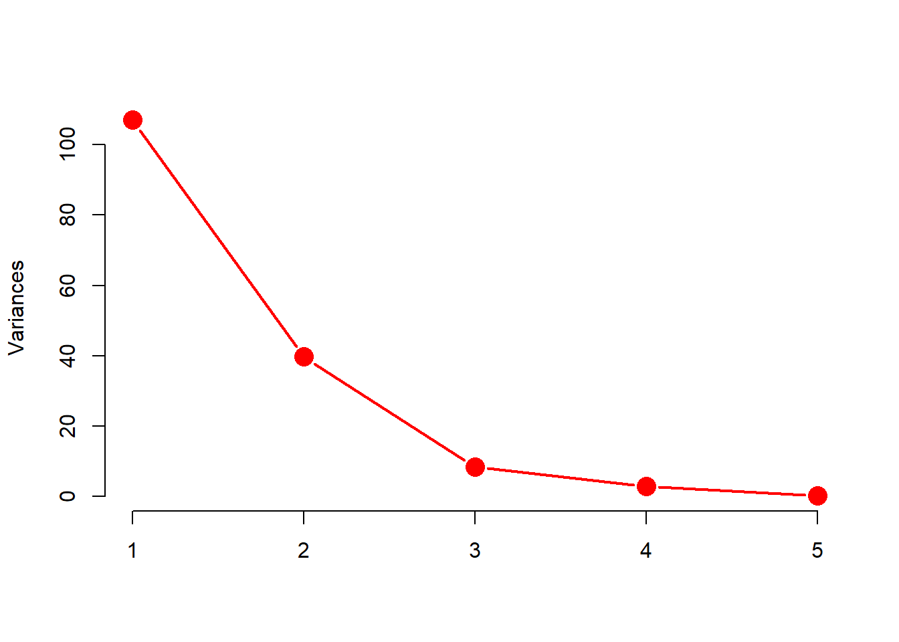

```r

# Another useful graphical method to help interpret the first two principal components is called the biplot.
# Biplots are a graphical method for simultaneously displaying the variables and sample units described by a multivariate data matrix.

biplot(X.pc, col = c(2, 3), cex = c(.75, 1.5),
       xlim = c( -.45, .45),
       xlab = "First principal component",
       ylab = "Second principal component",
       main = "Biplot")
```

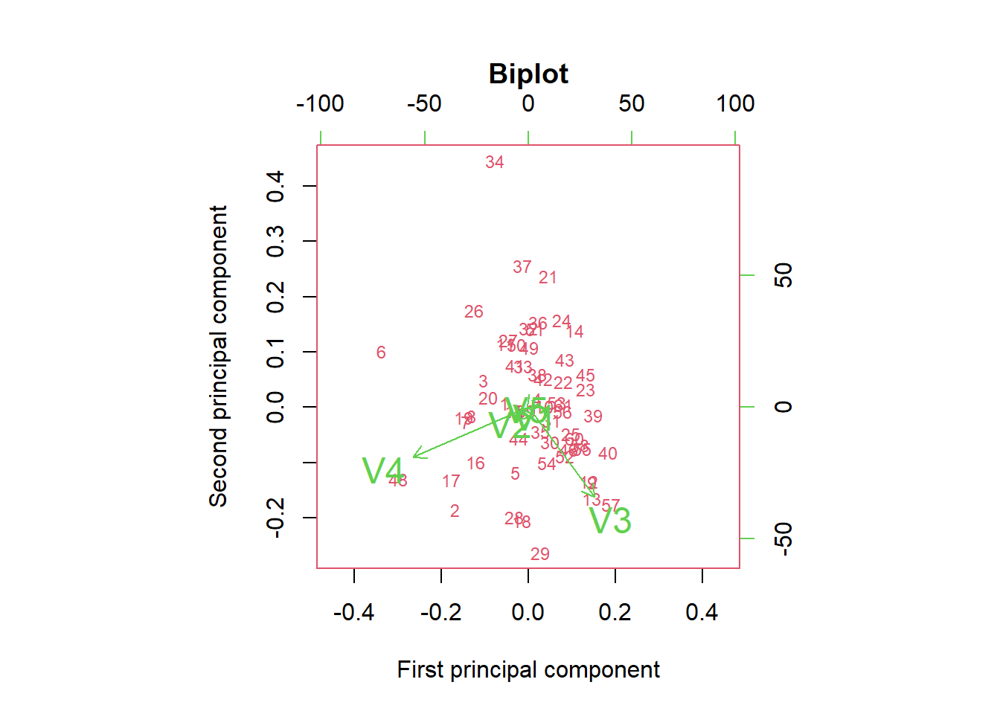

```r

# use the factoextra package to create a ggplot2-based elegant visualization.

# (1) Visualize eigenvalues (scree plot). Show the percentage of variances explained by each principal component.
library(factoextra)
#> Loading required package: ggplot2
#> Welcome! Want to learn more? See two factoextra-related books at https://goo.gl/ve3WBa
fviz_eig(X.pc)
```

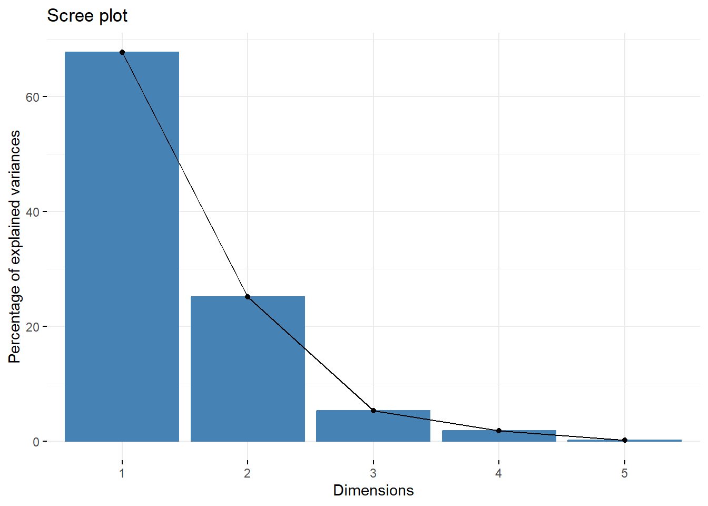

```r


# (2) Graph of individuals. Individuals with a similar profile are grouped together.
fviz_pca_ind(X.pc,
             col.ind = "cos2", # Color by the quality of representation
             gradient.cols = c("#00AFBB", "#E7B800", "#FC4E07"),
             repel = TRUE     # Avoid text overlapping
)
```

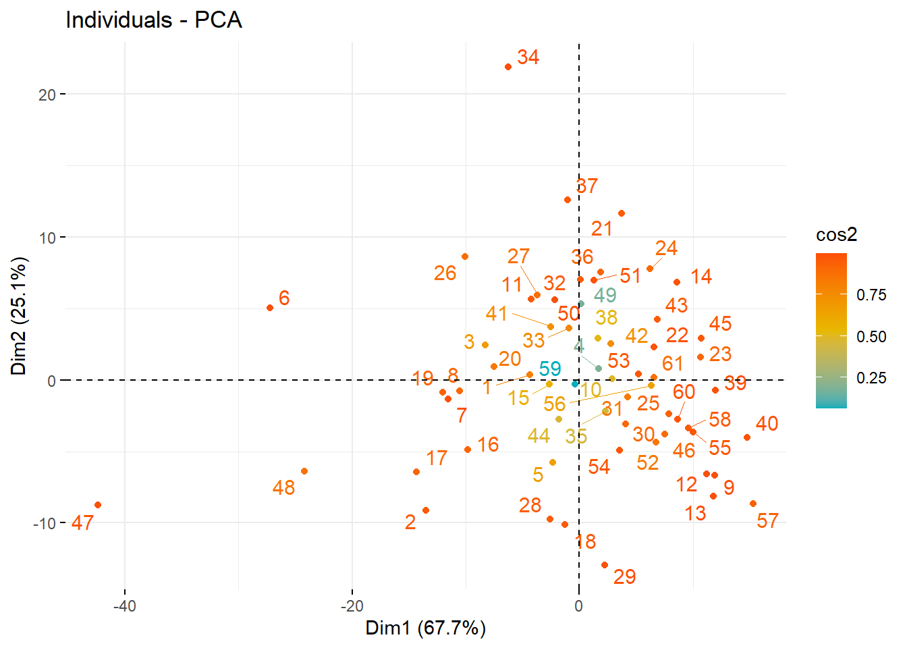

```r

## The quality of representation shows the importance of a principal component for a given observation
## Some details about computing cos2: the quality of representation
# a. Coordinates of individuals on the principal components
ind.coord <- X.pc$x
ind.coord
#>                PC1          PC2          PC3         PC4
#>  [1,]  -4.35590788   0.35186425  -1.58945113 -1.35312421
#>  [2,] -13.50089124  -9.11108690   1.79713519 -2.74284848
#>  [3,]  -8.30048747   2.42902922  -5.89221657  0.24041504
#>  [4,]   1.67803285   0.76997301  -3.61863740  1.35257624
#>  [5,]  -2.31333719  -5.77611226  -4.16751019  1.55935662
#>  [6,] -27.20948854   5.01664733   1.71320375  1.69502211
#>  [7,] -11.53924438  -1.32704212   0.37488801 -1.07590362
#>  [8,] -10.52195183  -0.74937149   2.46870301 -2.18860529
#>  [9,]  11.93915794  -6.68524631  -0.78114090  0.14065720
#> [10,]   2.90857069   0.09857903   1.43475296  2.54080801
#> [11,]  -4.22662722   5.63897636  -0.75992016  1.18523960
#> [12,]  11.21729466  -6.58230929  -0.69763216 -0.44553475
#> [13,]  11.76870098  -8.12003515  -0.44887539 -0.42428346
#> [14,]   8.61492991   6.80778546   1.01950682 -1.17174146
#> [15,]  -2.63885151  -0.30425990  -2.27721394 -0.33321186
#> [16,]  -9.84423032  -4.88350530   0.23395391  2.98731285
#> [17,] -14.32332530  -6.44892755  -4.64933497 -1.34686336
#> [18,]  -1.27647689 -10.14267573   1.09724286  1.83975359
#> [19,] -12.01851652  -0.88860200   2.85413785  1.78024283
#> [20,]  -7.49751789   0.90518422   2.53251108 -2.06764467
#> [21,]   3.70958180  11.65012840   1.03525923  2.42328264
#> [22,]   6.53972433   2.28849038  -0.29989444  0.85601375
#> [23,]  10.68236211   1.57684077  -2.79007521  0.73904522
#> [24,]   6.23525521   7.77884139  -2.89627716 -1.62285138
#> [25,]   7.86457056  -2.36929347   2.21051873  0.12333510
#> [26,] -10.05425476   8.61467906  -0.81334367  4.62947057
#> [27,]  -3.70152919   5.94901244   1.38243735  2.18970560
#> [28,]  -2.55724536  -9.76466732   2.07341983  0.92872290
#> [29,]   2.25066152 -12.93256096   1.41579595  0.01121266
#> [30,]   4.08395782  -3.06487755   1.10967447  0.96834948
#> [31,]   4.27243668  -1.20039106   1.94652293 -0.02006664
#> [32,]   0.06772707   7.03521654   1.48631653  0.09524844
#> [33,]  -0.89581686   3.63416759   1.41384538 -1.40983377
#> [34,]  -6.26902189  21.91218124   0.45398163 -0.93050925
#> [35,]   2.27556068  -2.19712502   2.84005779 -1.98339256
#> [36,]   1.87415219   7.55381324   1.97726412 -0.94662635
#> [37,]  -1.04949457  12.61370671   1.15613339 -2.05363955
#> [38,]   1.65346742   2.90483086   1.45968221 -2.86584307
#> [39,]  11.98009486  -0.71497795   1.26110626  0.36935136
#> [40,]  14.77876088  -4.04269064   0.93421343 -1.81526203
#> [41,]  -2.51990646   3.73524802   2.41471713 -1.20668116
#> [42,]   2.77386149   2.53137189   0.19562350 -2.24806954
#> [43,]   6.83857818   4.24339807   1.20659676 -1.38354598
#> [44,]  -1.77961535  -2.75542840   3.43534553  0.03437226
#> [45,]  10.70286382   2.93485943   1.19032076 -1.67718929
#> [46,]   7.49399613  -3.77801594   2.46341714  1.29217524
#> [47,] -42.36628241  -8.76520545   4.97086441 -1.44319135
#> [48,] -24.22446138  -6.38754714  -9.82666882 -0.50710578
#> [49,]   0.13240425   5.31021704 -11.53099879 -0.59200525
#> [50,]  -2.14733165   5.59148404   0.04051858 -0.43828914
#> [51,]   1.25284200   6.98383229   0.63762120 -0.77478367
#> [52,]   6.76125397  -4.37736497   3.04986115  1.67811821
#> [53,]   5.19771634   0.40539870   0.56514378  0.71248814
#> [54,]   3.52150287  -4.93579093  -0.13654685  0.94284241
#> [55,]  10.02360265  -3.65840314   0.85647490 -1.56310331
#> [56,]   6.32269161  -0.40546923   1.78126446  4.22904619
#> [57,]  15.30911808  -8.65424313  -3.59471831 -2.87420152
#> [58,]   9.61147274  -3.36319151  -1.19747251  1.83007687
#> [59,]  -0.37962981  -0.28874022  -1.80806881  0.09620502
#> [60,]   8.62662402  -2.77689303  -1.32620405 -0.04616036
#> [61,]   6.54791557   0.18629405  -1.38783253  2.08166593
#>                PC5
#>  [1,] -0.281419035
#>  [2,] -0.004409154
#>  [3,] -0.325234441
#>  [4,] -0.325379930
#>  [5,] -0.161937766
#>  [6,] -0.135732724
#>  [7,] -0.106860604
#>  [8,]  0.146410475
#>  [9,]  0.339512953
#> [10,] -0.218338448
#> [11,] -0.366973284
#> [12,] -0.223623495
#> [13,] -0.252236221
#> [14,] -0.064193706
#> [15,]  0.079385117
#> [16,] -0.578778520
#> [17,] -0.326057864
#> [18,] -0.262918633
#> [19,]  0.185057340
#> [20,] -0.025466818
#> [21,] -0.575103051
#> [22,]  0.010524588
#> [23,]  1.735756491
#> [24,] -0.205736270
#> [25,] -0.012710470
#> [26,]  1.142817998
#> [27,]  0.194455278
#> [28,] -0.323278854
#> [29,] -0.110941682
#> [30,] -0.509724275
#> [31,] -0.403969336
#> [32,] -0.286508631
#> [33,] -0.109520935
#> [34,]  0.387464462
#> [35,] -0.010326808
#> [36,]  0.017552430
#> [37,]  0.023366776
#> [38,] -0.162939168
#> [39,] -0.110648611
#> [40,]  0.227289567
#> [41,] -0.175098878
#> [42,] -0.227413622
#> [43,] -0.037211916
#> [44,]  0.085079555
#> [45,]  0.021369217
#> [46,] -0.091645314
#> [47,]  0.847525584
#> [48,] -0.007532702
#> [49,] -0.150576006
#> [50,] -0.224401674
#> [51,]  0.062522325
#> [52,]  0.106851844
#> [53,]  0.081161521
#> [54,]  0.394161422
#> [55,]  0.219167679
#> [56,]  0.013383974
#> [57,]  0.973097369
#> [58,]  0.438319159
#> [59,] -0.189279132
#> [60,] -0.212210738
#> [61,]  0.064105593
# b. Calculate the square distance between each individual and the PCA center of gravity
n <- nrow(X)
d2 <- rowSums(ind.coord^2)
cos2 <- round(apply(ind.coord, 2, function(x)  x^2/d2), 2)
cos2
#>        PC1  PC2  PC3  PC4  PC5
#>  [1,] 0.81 0.01 0.11 0.08 0.00
#>  [2,] 0.66 0.30 0.01 0.03 0.00
#>  [3,] 0.63 0.05 0.32 0.00 0.00
#>  [4,] 0.15 0.03 0.71 0.10 0.01
#>  [5,] 0.09 0.57 0.30 0.04 0.00
#>  [6,] 0.96 0.03 0.00 0.00 0.00
#>  [7,] 0.98 0.01 0.00 0.01 0.00
#>  [8,] 0.91 0.00 0.05 0.04 0.00
#>  [9,] 0.76 0.24 0.00 0.00 0.00
#> [10,] 0.50 0.00 0.12 0.38 0.00
#> [11,] 0.35 0.61 0.01 0.03 0.00
#> [12,] 0.74 0.26 0.00 0.00 0.00
#> [13,] 0.68 0.32 0.00 0.00 0.00
#> [14,] 0.60 0.38 0.01 0.01 0.00
#> [15,] 0.56 0.01 0.42 0.01 0.00
#> [16,] 0.75 0.18 0.00 0.07 0.00
#> [17,] 0.76 0.15 0.08 0.01 0.00
#> [18,] 0.01 0.94 0.01 0.03 0.00
#> [19,] 0.92 0.01 0.05 0.02 0.00
#> [20,] 0.83 0.01 0.09 0.06 0.00
#> [21,] 0.09 0.87 0.01 0.04 0.00
#> [22,] 0.88 0.11 0.00 0.02 0.00
#> [23,] 0.89 0.02 0.06 0.00 0.02
#> [24,] 0.35 0.55 0.08 0.02 0.00
#> [25,] 0.85 0.08 0.07 0.00 0.00
#> [26,] 0.51 0.37 0.00 0.11 0.01
#> [27,] 0.25 0.63 0.03 0.09 0.00
#> [28,] 0.06 0.89 0.04 0.01 0.00
#> [29,] 0.03 0.96 0.01 0.00 0.00
#> [30,] 0.59 0.33 0.04 0.03 0.01
#> [31,] 0.77 0.06 0.16 0.00 0.01
#> [32,] 0.00 0.96 0.04 0.00 0.00
#> [33,] 0.04 0.73 0.11 0.11 0.00
#> [34,] 0.08 0.92 0.00 0.00 0.00
#> [35,] 0.24 0.22 0.37 0.18 0.00
#> [36,] 0.05 0.87 0.06 0.01 0.00
#> [37,] 0.01 0.96 0.01 0.03 0.00
#> [38,] 0.13 0.39 0.10 0.38 0.00
#> [39,] 0.98 0.00 0.01 0.00 0.00
#> [40,] 0.91 0.07 0.00 0.01 0.00
#> [41,] 0.23 0.51 0.21 0.05 0.00
#> [42,] 0.40 0.33 0.00 0.26 0.00
#> [43,] 0.69 0.26 0.02 0.03 0.00
#> [44,] 0.14 0.34 0.52 0.00 0.00
#> [45,] 0.90 0.07 0.01 0.02 0.00
#> [46,] 0.72 0.18 0.08 0.02 0.00
#> [47,] 0.95 0.04 0.01 0.00 0.00
#> [48,] 0.81 0.06 0.13 0.00 0.00
#> [49,] 0.00 0.17 0.82 0.00 0.00
#> [50,] 0.13 0.87 0.00 0.01 0.00
#> [51,] 0.03 0.95 0.01 0.01 0.00
#> [52,] 0.59 0.25 0.12 0.04 0.00
#> [53,] 0.96 0.01 0.01 0.02 0.00
#> [54,] 0.33 0.64 0.00 0.02 0.00
#> [55,] 0.86 0.11 0.01 0.02 0.00
#> [56,] 0.65 0.00 0.05 0.29 0.00
#> [57,] 0.71 0.23 0.04 0.02 0.00
#> [58,] 0.85 0.10 0.01 0.03 0.00
#> [59,] 0.04 0.02 0.92 0.00 0.01
#> [60,] 0.89 0.09 0.02 0.00 0.00
#> [61,] 0.87 0.00 0.04 0.09 0.00
rowSums(cos2[,1:2])
#>  [1] 0.82 0.96 0.68 0.18 0.66 0.99 0.99 0.91 1.00 0.50 0.96
#> [12] 1.00 1.00 0.98 0.57 0.93 0.91 0.95 0.93 0.84 0.96 0.99
#> [23] 0.91 0.90 0.93 0.88 0.88 0.95 0.99 0.92 0.83 0.96 0.77
#> [34] 1.00 0.46 0.92 0.97 0.52 0.98 0.98 0.74 0.73 0.95 0.48
#> [45] 0.97 0.90 0.99 0.87 0.17 1.00 0.98 0.84 0.97 0.97 0.97
#> [56] 0.65 0.94 0.95 0.06 0.98 0.87

# (3) Graph of variables. Positive correlated variables point to the same side of the plot. Negative correlated variables point to opposite sides of the graph.
fviz_pca_var(X.pc,
             col.var = "contrib", # Color by contributions to the PC
             gradient.cols = c("#00AFBB", "#E7B800", "#FC4E07"),
             repel = TRUE     # Avoid text overlapping
)
```

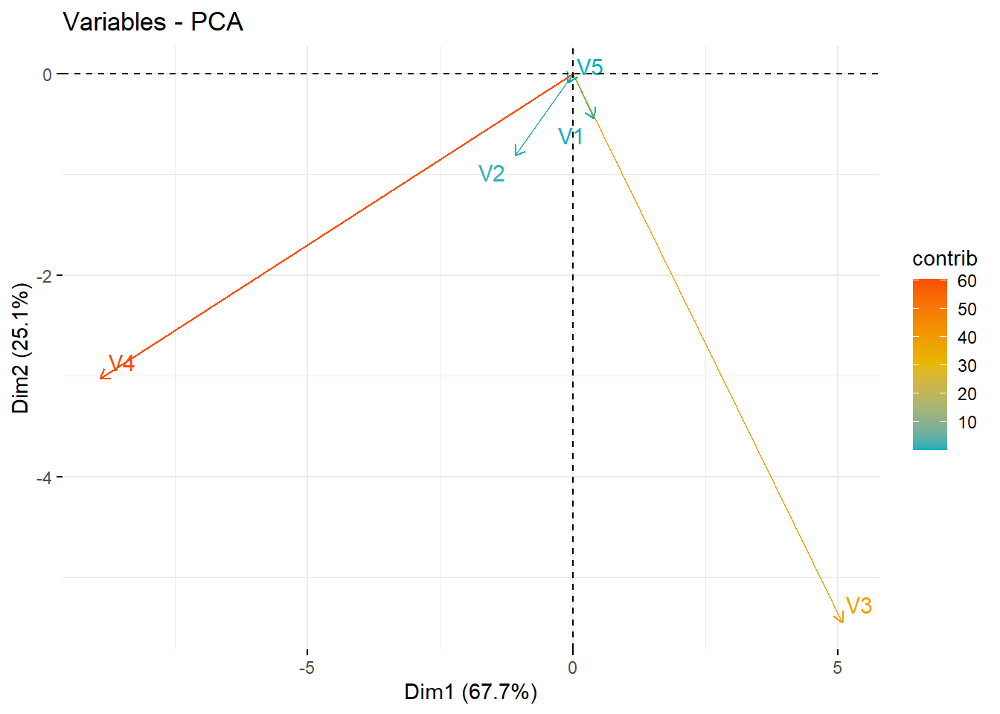

```r

# (4) Biplot of individuals and variables
fviz_pca_biplot(X.pc, 
                repel = TRUE,
                col.var = "#2E9FDF", # Variables color
                col.ind = "#696969"  # Individuals color
)
```

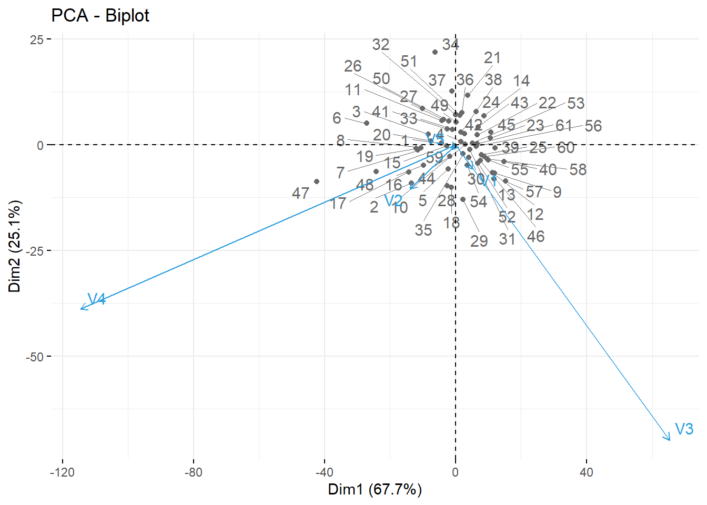

## Example 8.10, Example 8.11


```r
X <-  read.table("dataset/T8-2.dat",header=FALSE)
X
#>         V1      V2      V3      V4     V5
#> 1   2044.9   588.2   425.8  -189.1 -209.8
#> 2  -2143.7  -686.2   883.6  -565.9 -441.5
#> 3   -177.8  -464.6   707.5   736.3   38.2
#> 4  -2186.2   450.5  -184.0   443.7 -325.3
#> 5   -878.6  -545.8   115.7   296.4  437.5
#> 6    563.2 -1045.4   281.2   620.5  142.7
#> 7    403.1    66.8   340.6  -135.5  521.2
#> 8  -1988.9  -801.8 -1437.3  -148.8   61.6
#> 9    132.8   563.7   125.3    68.2  611.5
#> 10 -2787.3  -213.4     7.8   169.4 -202.3
#> 11   283.4  3936.9    -0.9   276.2 -159.6
#> 12   761.6   256.0 -2153.6  -418.8   28.2
#> 13  -498.3   244.7   966.5 -1142.3  182.6
#> 14  2366.2 -1193.7  -165.5   270.6 -344.9
#> 15  1917.8  -782.0   -82.9  -196.8  -89.9
#> 16  2187.7  -373.9   170.1   -84.1 -250.2
n <- nrow(X)
p <- ncol(X)

X.pc <- prcomp(X)
# values of the principal components
Y <- X.pc$x
Y
#>              PC1         PC2           PC3         PC4
#>  [1,] -2044.9108  -588.18998   425.8014318  -189.11860
#>  [2,]  2143.6969   686.18028   883.6071505  -565.91372
#>  [3,]   177.7921   464.60169   707.5038436   736.30458
#>  [4,]  2186.1878  -450.51761  -183.9938258   443.69157
#>  [5,]   878.5975   545.80132   115.7107748   296.42832
#>  [6,]  -563.2024  1045.40708   281.2031894   620.50453
#>  [7,]  -403.1044   -66.79005   340.6113523  -135.47071
#>  [8,]  1988.9026   801.78641 -1437.2896124  -148.79412
#>  [9,]  -132.8076  -563.69033   125.3126666    68.23589
#> [10,]  2787.2934   213.38002     7.8088146   169.40070
#> [11,]  -283.4329 -3936.89991    -0.8923354   276.19734
#> [12,]  -761.6016  -255.99816 -2153.5931791  -418.80896
#> [13,]   498.2963  -244.70169   966.5134292 -1142.28340
#> [14,] -2366.2012  1193.71037  -165.5042865   270.56662
#> [15,] -1917.8007   782.01030   -82.8986585  -196.81567
#> [16,] -2187.7050   373.91026   170.0992449   -84.12436
#>              PC5
#>  [1,]  209.77628
#>  [2,]  441.49580
#>  [3,]  -38.14340
#>  [4,]  325.32683
#>  [5,] -437.47036
#>  [6,] -142.64953
#>  [7,] -521.20697
#>  [8,]  -61.60321
#>  [9,] -611.50329
#> [10,]  202.32507
#> [11,]  159.55944
#> [12,]  -28.25294
#> [13,] -182.65658
#> [14,]  344.92000
#> [15,]   89.89036
#> [16,]  250.19249

library(factoextra)
fviz_eig(X.pc)
```

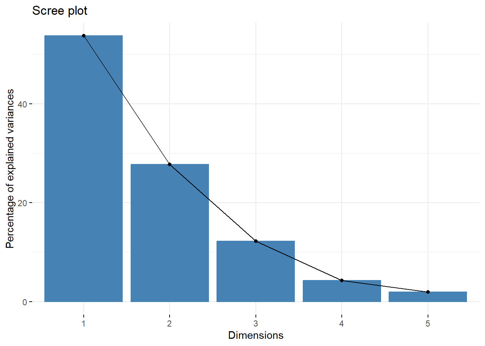

```r

# covariance matrix of first two sample PCs: y1 and y2
Y12 <- Y[, 1:2]
S <- diag(as.vector(X.pc$sdev^2)[1:2])
S
#>         [,1]    [,2]
#> [1,] 2770248       0
#> [2,]       0 1429193

## Two-part procedure
# (i) ellipse format chart for the first two PCs (y1, y2)
library(car)
#> Loading required package: carData
alpha <- 0.05
radius <- sqrt(qchisq(1-alpha, df = 2))
par(pty = "s")
plot(0, xlim=c(-5000, 5000), ylim=c(-4000, 4000), 
     xlab = expression(hat(y)[1]), ylab = expression(hat(y)[2]), type="n")
ellipse(center = colMeans(Y12), shape = S, radius = radius)
points(Y12[, 1], Y12[, 2])
```

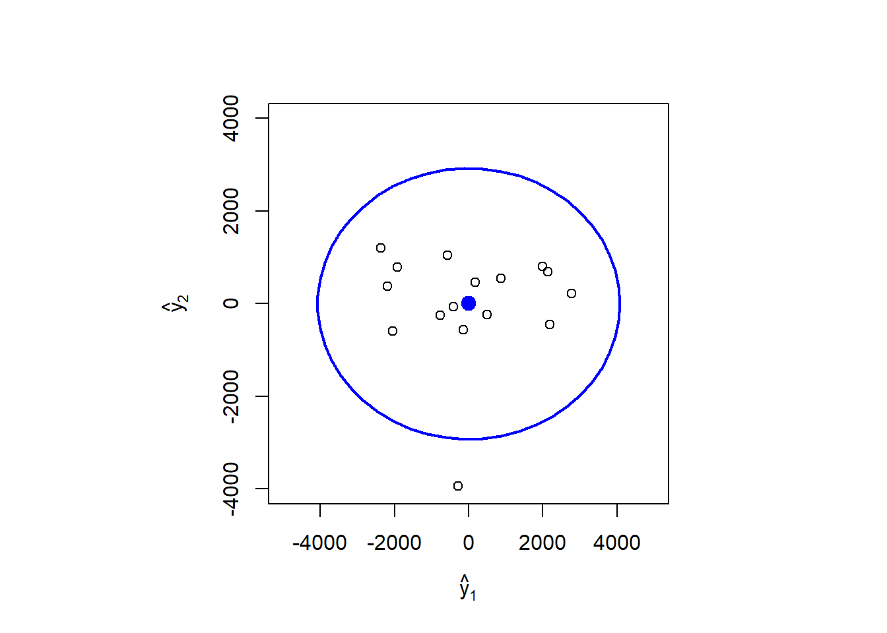

```r

# (ii) T^2 chart for the last p-2 PCs
T2 <- Y[, 3]^2/X.pc$sdev[3]^2 +
  Y[, 4]^2/X.pc$sdev[4]^2 +
  Y[, 5]^2/X.pc$sdev[5]^2

UCL <- qchisq(1-alpha, df = p - 2)

plot(1:n, T2, ylim = range(T2, UCL*1.05), type = 'p',
     xlab = "Period", ylab = expression(T^2),
     main = expression(paste(T^2,"-chart")))
abline(h = UCL, lty = 1, col = "red")
lines(1:n, T2)
```

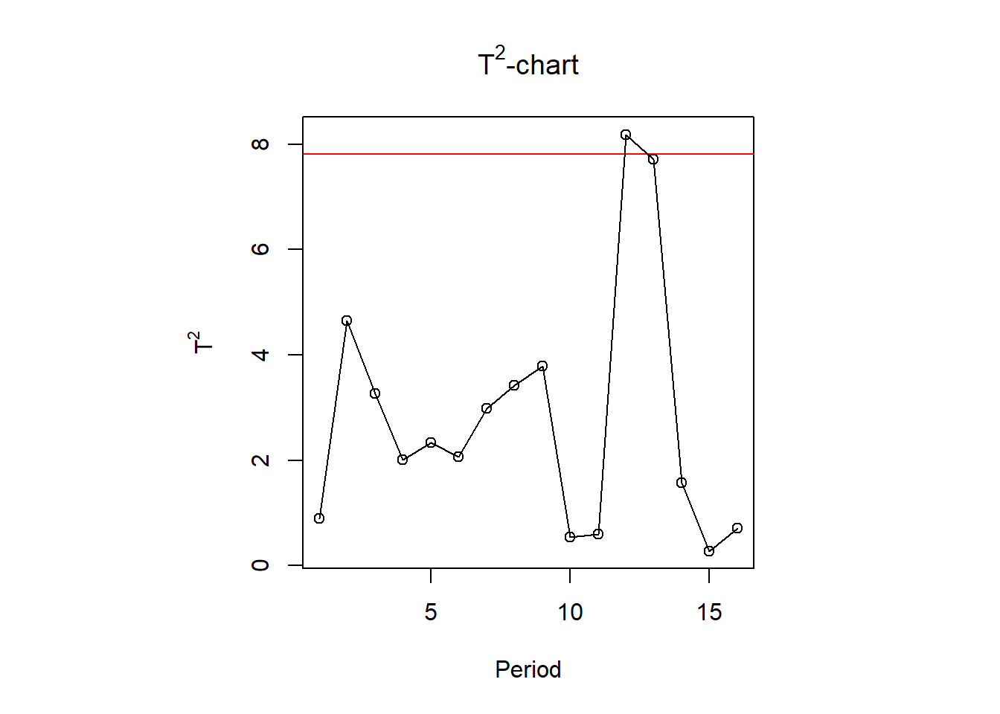

## Homework
### Exercise 8.1, 8.2


```r
Sigma <- matrix(c(5, 2,
                  2, 2), nrow = 2, byrow = T)

eigen(Sigma)
#> eigen() decomposition
#> $values
#> [1] 6 1
#> 
#> $vectors
#>            [,1]       [,2]
#> [1,] -0.8944272  0.4472136
#> [2,] -0.4472136 -0.8944272

V <- diag(diag(Sigma))
rho <- sqrt(solve(V)) %*% Sigma %*% sqrt(solve(V))

eigen(rho)
#> eigen() decomposition
#> $values
#> [1] 1.6324555 0.3675445
#> 
#> $vectors
#>           [,1]       [,2]
#> [1,] 0.7071068 -0.7071068
#> [2,] 0.7071068  0.7071068

# the correlation coefficients between the PC Y_i and the standardized variable Z_k
# Y_i, Z_k
i <- 1
k <- 1
ed <- eigen(rho)
ed$vector[k, i] * sqrt(ed$values[i])
#> [1] 0.9034532
```

### Exercise 8.22


```r
library(factoextra)
mydata <-  read.table("dataset/T1-10.dat",header=FALSE)
X <- mydata[, 3:9]
n <- nrow(X)
p <- ncol(X)

# use covariance matrix
X.pc <- prcomp(X)
# proportion of variance
round(X.pc$sdev^2/sum(X.pc$sdev^2),4)
#> [1] 0.8082 0.1914 0.0002 0.0001 0.0000 0.0000 0.0000
fviz_eig(X.pc)
```

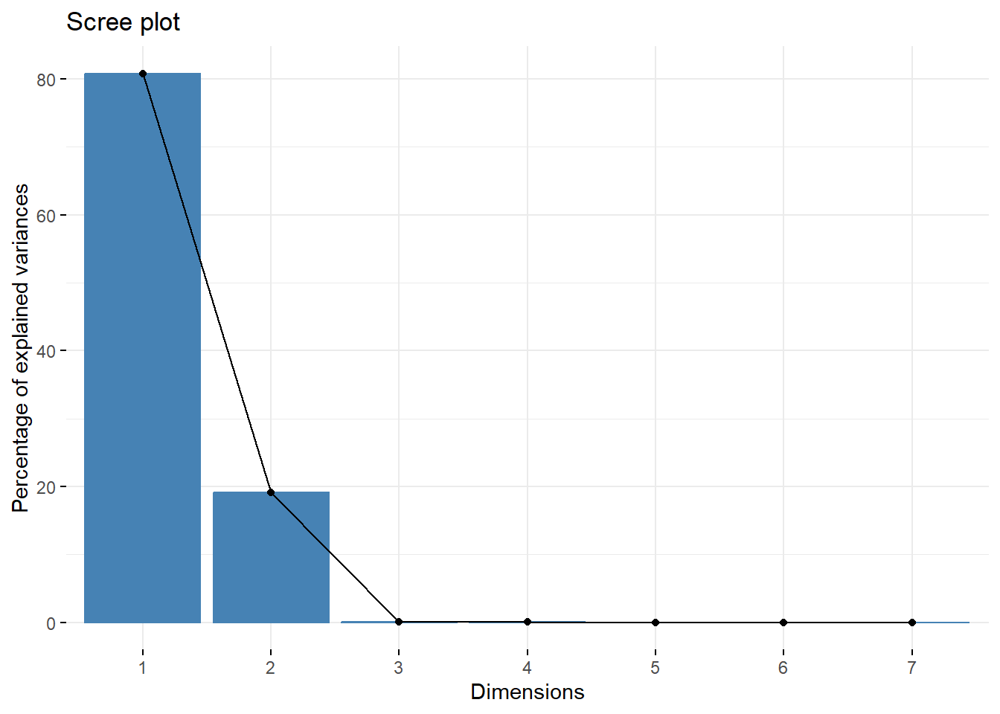

```r

# use correlation matrix
Z.pc <- prcomp(X, scale = T)
# proportion of variance
round(Z.pc$sdev^2/sum(Z.pc$sdev^2),4)
#> [1] 0.5887 0.1910 0.1059 0.0602 0.0265 0.0209 0.0067
fviz_eig(Z.pc)
```

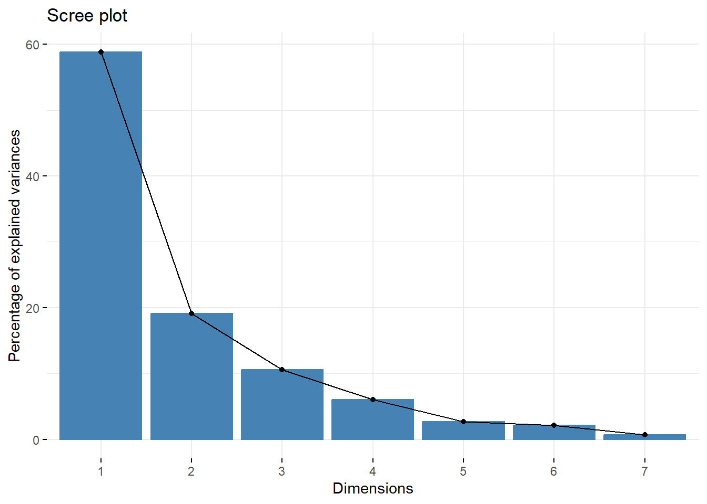

```r

pc1 <- X.pc$x[, 1]
pc2 <- X.pc$x[, 2]
plot(pc1,pc2,type='n')
text(pc1,pc2,mydata[, 1])
```

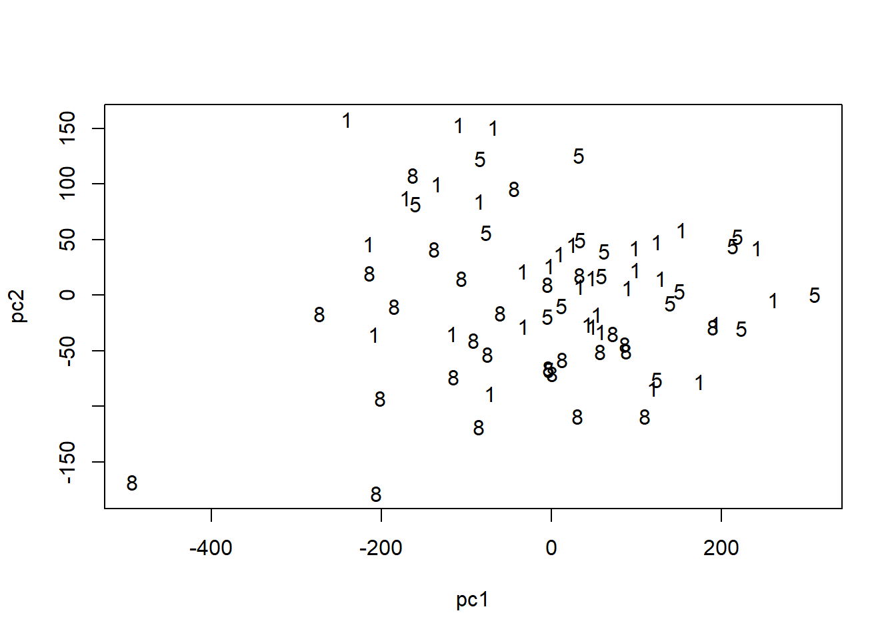

```r

qqnorm(pc1, pch = 1)
qqline(pc1, col = "red", lwd = 2)
```

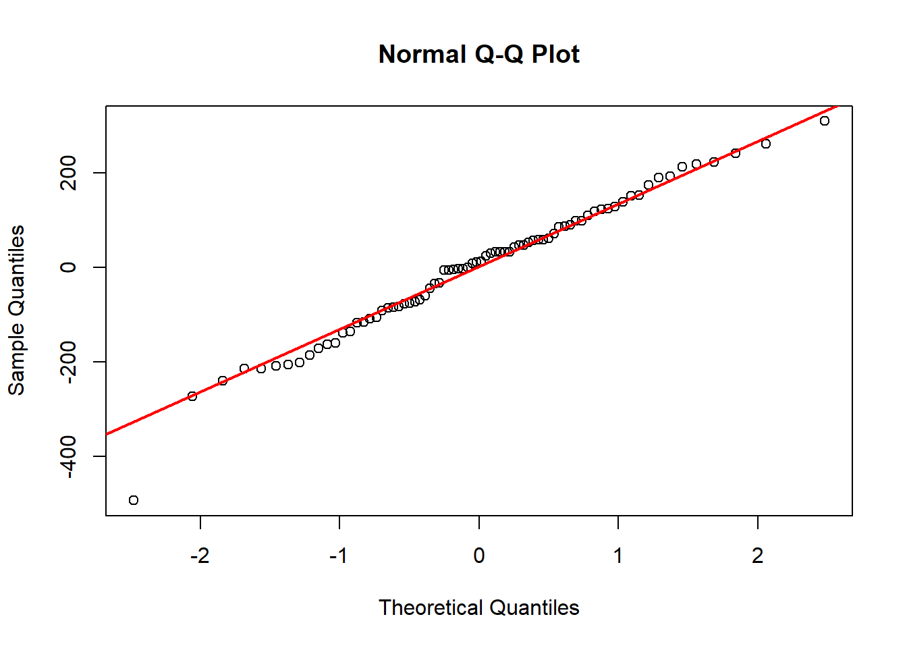


## Reference
[1] Johnson, R. A., and Wichern, D. W. (2007). Applied multivariate statistical analysis (6th ed.). Upper Saddle River, N.J.: Pearson Prentice Hall.

[2] Zelterman, D. (2015). Applied Multivariate Statistics with R (1st ed.).

[3] Principal Component Analysis in R: prcomp vs princomp, http://www.sthda.com/english/articles/31-principal-component-methods-in-r-practical-guide/118-principal-component-analysis-in-r-prcomp-vs-princomp/

