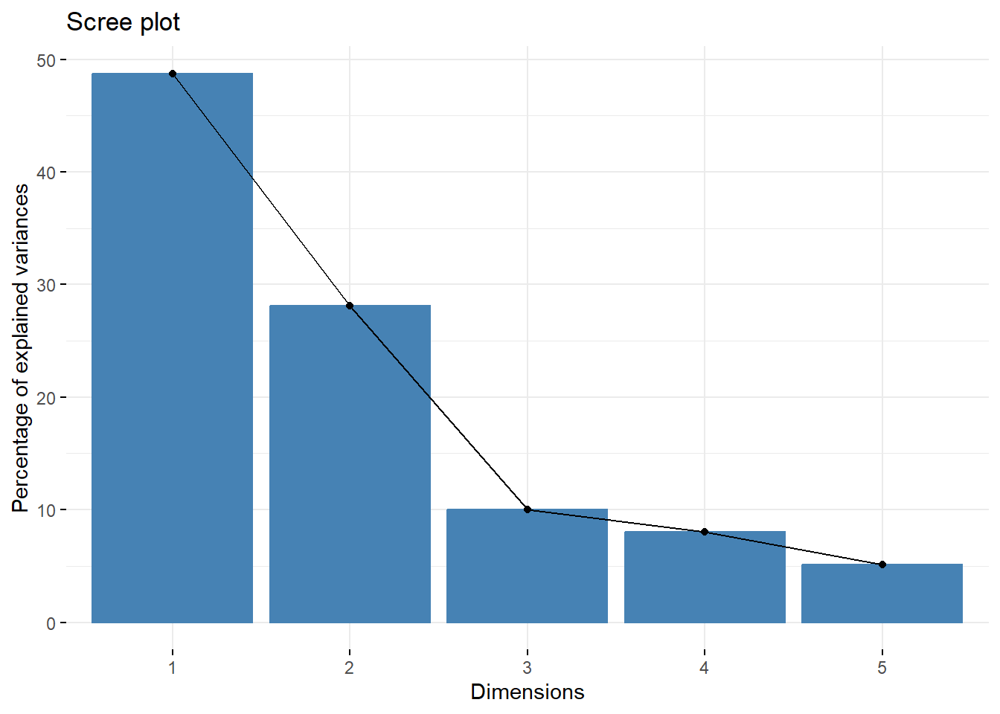
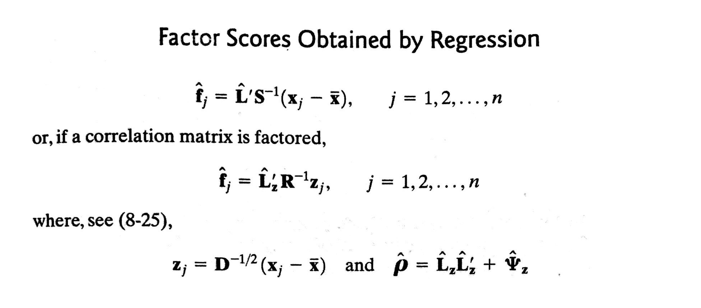

# Chapter 9: Factor Analysis


***

## Overview of FA

* **The essential purpose of FA**: to describe the covariance relationships among many variables in terms of a few understanding, but unobservable, random quantities called **factors**.


* **Basic objective 1**: to determine whether the $p$ variables exhibit patterns of relationship with each other such that 
    - the variables can be partitioned into, say, $m$ subsets ($m<p$),
    - each subset consists of a group of variables tending to be more highly related to others within the subset than to those in other subsets.
    
* **Example**:
    - Correlations from the group of test scores in classics, French, English, mathematics, and music collected by *Spearman* suggested **an underlying "intelligence" factor**.
    - A second group of variables: physical-fitness scores, if available, might correspond to **another factor**.
    - FA seeks to confirm such type of structure.

* **Basic objective 2**: to derive, create, or develop a new set of uncorrelated variables 
    - the new variables are called **underlying factors** or **underlying characteristics**
    - we hope the new variables give a better understanding of the data being analyzed
    - the new variables can then be used in future analyses of the data
    
* The factor analysis model assumes there is a smaller set of uncorrelated variables that, in some sense, drives or controls the values of the variables that are actually being measured.

* **The difference between PCA and FA**: PCA is a linear combination of variables; Factor Analysis is a measurement model of a latent variable.

## Warnings

* If the original variables are already uncorrelated, then there is little reason to consider performing a FA.
* Criticism on FA:
    - There is no unique solution to FA.
    - Subjective decisions are made for determining
        + the number of underlying factors
        + how they are created
        + how they should be interpreted
        + how individuals in the sample should be evaluated on the
        + new variables
        
## The Orthogonal Factor Model

$\vec X$ is a $p$-dimensional random vector $\sim (\vec \mu, \mathbf{\Sigma})$.

The factor analysis model is
$$X_i - \mu_i=l_{i1}F_1+l_{i2}F_2+\dots+l_{im}F_m+\epsilon_i,$$

* $X_i$ is the $i$-th component of $\vec X$.
* $F_1, F_2, \dots, F_m$ are called **common factors**
* $\epsilon_1, \epsilon_2, \dots, \epsilon_p$ are called **errors** or **specific factors**
* $l_{ij}$ is called the **loading** of the $i$th variable on the $j$th factor

or in matrix notation:

$$\underset{(p\times 1)}{\vec X - \vec \mu}=\underset{(p\times m)}{\mathbf{L}}\underset{(m\times 1)}{\vec F}+\underset{(p\times 1)}{\vec \epsilon}$$

* $\mathbf{L}$: **matrix of factor loadings**

### Orthogonal Factor Model with $m$ Common Factors

$$\underset{(p\times 1)}{\vec X}=\underset{(p\times 1)}{\vec \mu}+\underset{(p\times m)}{\mathbf{L}}\underset{(m\times 1)}{\vec F}+\underset{(p\times 1)}{\vec \epsilon}$$

$\mu_i$: mean of variable $i$

$\epsilon_i$: $i$th specific factor

$F_j$: $j$th common factor

$l_{ij}$: loading of the $i$th variable on the $j$th factor

**Assumptions**:

$\vec F$ and $\vec \epsilon$ are independent

$E(\vec F)=\vec 0, Cov(\vec F)=\mathbf{I}$

$E(\vec \epsilon)=\vec 0, Cov(\vec \epsilon)=\mathbf{\Psi}$, where $\mathbf{\Psi}$ is a diagonal matrix

### Covariance Structure of $\vec X$ under the Orthogonal Factor Model

* $\mathbf{\Sigma}=Cov(\vec X) = \mathbf{L}\mathbf{L}'+\mathbf{\Psi}$ (**factor analysis equation**)
* $Cov(\vec X, \vec F) = \mathbf{L}$

Then, we can decompose the variance of the $i$th variable into two parts:

(1) $i$th **communality**: $h_i^2=l_{i1}^2+l_{i2}^2+\dots+l_{im}^2$
(2) $i$th **uniqueness** or **specific variance**: $\psi_i$

$$Var(X_i)=\sigma_{ii}=h_i^2+\psi_i, i=1,2,\dots,p$$

* To determine if $\vec F, \mathbf{L}$ and $\vec \epsilon$ exist such that $\vec X- \vec \mu= \mathbf{L}\vec F+\vec \epsilon$, we try to find $\mathbf{L}$ and $\mathbf{\Psi}$ so that the factor analysis equation holds: $\mathbf{\Sigma}=\mathbf{L}\mathbf{L}'+\mathbf{\Psi}$.

* Remark: In practice, FA procedures are almost always applied to $Z$ scores and to the correlation matrix $\mathbf{\rho}$.

* Example 9.1: p. 484. Verifying $\mathbf{\Sigma}=\mathbf{L}\mathbf{L}'+\mathbf{\Psi}$ for two factors
* Example 9.2: p. 486. Nonexistence of a proper solution to the FA equation

### Nonuniqueness of the Factors

* For any $m \times m$ orthogonal matrix $\mathbf{T}$, we have

$$\mathbf{\Sigma}=\mathbf{L}\mathbf{L}'+\mathbf{\Psi}=\mathbf{LTT'L'}+\mathbf{\Psi}=\mathbf{(LT)}\mathbf{(LT)}'+\mathbf{\Psi}$$
and
$$Cov(\mathbf{T}'\vec F)=\mathbf{T}'\mathbf{T}=\mathbf{I}.$$

That is, if $\mathbf{L}$ is a loading matrix, then $\mathbf{L}^*=\mathbf{LT}$ is also a
loading matrix for factors $\vec F^*=\mathbf{T}'\vec F$, which satisfies

$$\mathbf{L}^*\vec F^*=\mathbf{L}\vec F.$$

Hence, **the factor loading matrix $\mathbf{L}$ is not unique**.

## 9.3 Methods of Estimation

**Question**: Does the FA model with a small number of factors, adequately represent the data? 

**Solution**:  verify the covariance relationship:

(1) $\mathbf{\Sigma}=Cov(\vec X) = \mathbf{L}\mathbf{L}'+\mathbf{\Psi}$ 
(2) $Cov(\vec X, \vec F) = \mathbf{L}$

* Parameters in the FA model: the factor loadings $l_{ij}$ and specific variances $\psi_{i}$.

* Two of the most popular methods of parameter estimation
    + the principal component (and the related principal factor) method
    + the maximum likelihood method.
    
### The Principal Component (and Principal Factor) Method

The spectral decomposition:

$$
\begin{aligned}
\mathbf{\Sigma} & = \lambda_1\vec e_1\vec e_1'+\dots+\lambda_p\vec e_p\vec e_p'\\
 &=\begin{bmatrix}
    \sqrt{\lambda_1}\vec e_1&
    \dots&
    \sqrt{\lambda_p}\vec e_p
 \end{bmatrix}
 \begin{bmatrix}
    \sqrt{\lambda_1}\vec e_1\\
    \dots\\
    \sqrt{\lambda_p}\vec e_p
 \end{bmatrix}
\end{aligned}
$$

where $\lambda_1\ge \lambda_2\ge\dots\lambda_p\ge0$.

Neglecting the last $p-m$ small eigenvalues and allowing for specific factors, we have the following approximation:

$$
\begin{aligned}
\mathbf{\Sigma} & \approx \mathbf{L}\mathbf{L}'+\mathbf{\Psi}\\
 &=\begin{bmatrix}
    \sqrt{\lambda_1}\vec e_1&
    \dots&
    \sqrt{\lambda_m}\vec e_m
 \end{bmatrix}
 \begin{bmatrix}
    \sqrt{\lambda_1}\vec e_1\\
    \dots\\
    \sqrt{\lambda_m}\vec e_m
 \end{bmatrix} +
\begin{bmatrix}
    \psi_{1} & 0 & \dots & 0 \\
    0 & \psi_{2} & \dots & 0 \\
    \vdots & \vdots & \ddots& \vdots \\
    0 & 0 & \dots & \psi_{p}
\end{bmatrix}
\end{aligned}
$$

#### Principle Component Solution of the Factor Model

(1) The matrix of estimated factor loadings $\{\tilde{l}_{ij}\}$:

$$\widetilde{\mathbf{L}}=\begin{bmatrix}
    \sqrt{\hat\lambda_1}\hat{\vec e_1}&
    \dots&
    \sqrt{\hat\lambda_m}\hat{\vec e_m}
 \end{bmatrix},$$

where $({\hat\lambda_i}\hat{\vec e_i})$ are eigenvalue-eigenvector pairs of the sample covariance matrix $\mathbf{S}$, and $\hat\lambda_1\ge \hat\lambda_2\ge\dots\hat\lambda_p\ge0$.

(2) The estimated specific variances are provided by the diagonal elements of $\mathbf{S} - \widetilde{\mathbf{L}}\widetilde{\mathbf{L}}'$:

$$\widetilde{\mathbf{\Psi}}=\begin{bmatrix}
    \widetilde\psi_{1} & 0 & \dots & 0 \\
    0 & \widetilde\psi_{2} & \dots & 0 \\
    \vdots & \vdots & \ddots& \vdots \\
    0 & 0 & \dots & \widetilde\psi_{p}
\end{bmatrix} \text{ with } \widetilde\psi_{i}=s_{ii} - \sum_{j=1}^m\tilde{l}_{ij}^2,$$

(3) Communalities are estimated as $\tilde{h}_{i}^2=\sum_{j=1}^m\tilde{l}_{ij}^2$


(4) The residual matrix: $\mathbf{S} - (\widetilde{\mathbf{L}}\widetilde{\mathbf{L}}' + \widetilde{\mathbf{\Psi}})$.

(5) The contribution to the total sample variance from the $j$th factor: $\sum_{i=1}^p\tilde{l}_{ij}^2=\hat\lambda_i$

#### Example 9.3 (p. 491)


#### Example 9.4 (p. 493, FA of stock-price data)


```r
X <- as.matrix(read.table("dataset/T8-4.DAT"))
colnames(X) <- c("JPM", "Citi", "WellsF", "Shell", "Exxon")
head(X)
#>             JPM       Citi     WellsF      Shell      Exxon
#> [1,]  0.0130338 -0.0078431 -0.0031889 -0.0447693  0.0052151
#> [2,]  0.0084862  0.0166886 -0.0062100  0.0119560  0.0134890
#> [3,] -0.0179153 -0.0086393  0.0100360  0.0000000 -0.0061428
#> [4,]  0.0215589 -0.0034858  0.0174353 -0.0285917 -0.0069534
#> [5,]  0.0108225  0.0037167 -0.0101345  0.0291900  0.0409751
#> [6,]  0.0101713 -0.0121978 -0.0083768  0.0137083  0.0029895

# PCA based on the spectral decomposition
# cor=T: standardized variables/correlation matrix
X.pc <- princomp(X, cor=T)
library(factoextra)
#> Loading required package: ggplot2
#> Welcome! Want to learn more? See two factoextra-related books at https://goo.gl/ve3WBa
fviz_eig(X.pc)
```



```r

R <- cor(X)
ed <- eigen(R)
lambda <- ed$values
lambda
#> [1] 2.4372731 1.4070127 0.5005127 0.4000316 0.2551699
ei <- ed$vectors

L.all <- ei %*% diag(sqrt(lambda)) 

# m = 2
m <- 2
L <- L.all[, 1:m] # estimated factor loadings
h2 <- rowSums(L^2) # communalities
psi <- 1 - h2 # estimated specific variances

df <- data.frame(variable=c(colnames(X)),
                 F1=L[, 1],
                 F2=L[, 2],
                 h2=h2,
                 psi=psi)
df[sapply(df, is.numeric)] <- round(df[sapply(df, is.numeric)], 3)
df
#>   variable     F1     F2    h2   psi
#> 1      JPM -0.732  0.437 0.727 0.273
#> 2     Citi -0.831  0.280 0.770 0.230
#> 3   WellsF -0.726  0.374 0.667 0.333
#> 4    Shell -0.605 -0.694 0.847 0.153
#> 5    Exxon -0.563 -0.719 0.834 0.166

Residual <- R - L %*% t(L) - diag(psi)
Residual
#>                JPM        Citi       WellsF        Shell
#> JPM     0.00000000 -0.09884073 -0.184513342 -0.025317756
#> Citi   -0.09884073  0.00000000 -0.134323655  0.014310342
#> WellsF -0.18451334 -0.13432365  0.000000000  0.002794963
#> Shell  -0.02531776  0.01431034  0.002794963  0.000000000
#> Exxon   0.05580220 -0.05378426  0.005960127 -0.155835955
#>               Exxon
#> JPM     0.055802201
#> Citi   -0.053784258
#> WellsF  0.005960127
#> Shell  -0.155835955
#> Exxon   0.000000000
```

In this example, the first factor might be called **market factor**, and the second factor might be called **industry factor**.

### The Maximum likelihood Method

* We assume normality, and maximize the likelihood over $\vec \mu$ and $\mathbf{\Sigma}$, subject to $\mathbf{\Sigma}=\mathbf{L}\mathbf{L}'+\mathbf{\Psi}$.

* It is desirable to make $\mathbf{L}$ **well defined** by imposing the computationally convenient uniqueness condition:

$$\mathbf{L}'\mathbf{\Psi}^{-1}\mathbf{L}=\mathbf{\Delta}=diag\{\delta_1\ge\dots\ge\delta_m\}$$

* We require that there are less parameters in the restricted FA model than in the unrestricted model.
    + number of parameters in the restricted FA model ($\mathbf{L}\mathbf{L}'+\mathbf{\Psi}$): $p+pm-(m-1)m/2$
    + number of parameters in the unrestricted model ($\mathbf{\Sigma}$): $p(p+1)/2$
    
#### Example 9.5 (Factor analysis of stock-price data using the maximum likelihood method)


```r
X <- as.matrix(read.table("dataset/T8-4.DAT"))
colnames(X) <- c("JPM", "Citi", "WellsF", "Shell", "Exxon")
head(X)
#>             JPM       Citi     WellsF      Shell      Exxon
#> [1,]  0.0130338 -0.0078431 -0.0031889 -0.0447693  0.0052151
#> [2,]  0.0084862  0.0166886 -0.0062100  0.0119560  0.0134890
#> [3,] -0.0179153 -0.0086393  0.0100360  0.0000000 -0.0061428
#> [4,]  0.0215589 -0.0034858  0.0174353 -0.0285917 -0.0069534
#> [5,]  0.0108225  0.0037167 -0.0101345  0.0291900  0.0409751
#> [6,]  0.0101713 -0.0121978 -0.0083768  0.0137083  0.0029895

m <- 2
# Maximum likelihood solution
# The R function factanal() computes the mle on the basis of the sample correlation matrix R.
fit.mle <- factanal(X, m, rotation = "none") # agrees with textbook (almost); "varimax" is the default
fit.mle
#> 
#> Call:
#> factanal(x = X, factors = m, rotation = "none")
#> 
#> Uniquenesses:
#>    JPM   Citi WellsF  Shell  Exxon 
#>  0.417  0.275  0.542  0.005  0.530 
#> 
#> Loadings:
#>        Factor1 Factor2
#> JPM     0.121   0.754 
#> Citi    0.328   0.786 
#> WellsF  0.188   0.650 
#> Shell   0.997         
#> Exxon   0.685         
#> 
#>                Factor1 Factor2
#> SS loadings      1.622   1.610
#> Proportion Var   0.324   0.322
#> Cumulative Var   0.324   0.646
#> 
#> Test of the hypothesis that 2 factors are sufficient.
#> The chi square statistic is 1.97 on 1 degree of freedom.
#> The p-value is 0.16

# check: 
colSums(fit.mle$loadings^2)
#>  Factor1  Factor2 
#> 1.622061 1.609847

L <- fit.mle$loadings
L
#> 
#> Loadings:
#>        Factor1 Factor2
#> JPM     0.121   0.754 
#> Citi    0.328   0.786 
#> WellsF  0.188   0.650 
#> Shell   0.997         
#> Exxon   0.685         
#> 
#>                Factor1 Factor2
#> SS loadings      1.622   1.610
#> Proportion Var   0.324   0.322
#> Cumulative Var   0.324   0.646
Psi <- diag(fit.mle$uniquenesses)
round(t(L)%*%solve(Psi)%*%L,4) # diagonal
#>          Factor1 Factor2
#> Factor1 200.3689  0.0000
#> Factor2   0.0000  4.4049
resids.mle <- R - (L%*%t(L) + Psi) # much smaller than residsual from the PC solution
resids.mle
#>                  JPM          Citi        WellsF
#> JPM     1.055860e-07  7.496780e-06 -2.564223e-03
#> Citi    7.496780e-06  3.255672e-08  1.608871e-03
#> WellsF -2.564223e-03  1.608871e-03  5.157370e-08
#> Shell  -3.325561e-04  2.116218e-04 -9.518792e-06
#> Exxon   5.198222e-02 -3.307885e-02  5.547153e-04
#>                Shell         Exxon
#> JPM    -3.325561e-04  5.198222e-02
#> Citi    2.116218e-04 -3.307885e-02
#> WellsF -9.518792e-06  5.547153e-04
#> Shell  -1.559500e-06  1.218853e-04
#> Exxon   1.218853e-04  2.670491e-07
round(resids.mle, 4)
#>            JPM    Citi  WellsF  Shell   Exxon
#> JPM     0.0000  0.0000 -0.0026 -3e-04  0.0520
#> Citi    0.0000  0.0000  0.0016  2e-04 -0.0331
#> WellsF -0.0026  0.0016  0.0000  0e+00  0.0006
#> Shell  -0.0003  0.0002  0.0000  0e+00  0.0001
#> Exxon   0.0520 -0.0331  0.0006  1e-04  0.0000
```

The ML method suggests that the first factor might be called **banking factor**, and the second factor might be called **oil industry factor**.

### A Large Sample Test for the Number of Common Factors

In the result of Example 9.5, there is a likelihood ratio test for $m$:

"Test of the hypothesis that 2 factors are sufficient. The chi square statistic is 1.97 on 1 degree of freedom. The p-value is 0.16."

#### likelihood ratio test for $m$

From Equation (4-18), Result 5.2, and Supplement 9A in the textbook, we have the likelihood ratio statistic for $H_0: \mathbf{\Sigma}=\mathbf{L}\mathbf{L}'+\mathbf{\Psi}$:

$$-2\ln\Lambda = n\ln\bigg(\frac{|\hat{\mathbf{L}} \hat{\mathbf{L}}'+\hat{\mathbf{\Psi}}|}{|(n-1)/n\mathbf{S}|}\bigg).$$

The Bartlett's correlation:

$$(n-1-(2p+4m+5)/6)\ln\bigg(\frac{|\hat{\mathbf{L}} \hat{\mathbf{L}}'+\hat{\mathbf{\Psi}}|}{|(n-1)/n\mathbf{S}|}\bigg)\sim \chi^2_{[(p-m)^2]-(p+m)]/2}$$

## 9.4 Factor Rotation $\mathbf{L}^*=\mathbf{LT}$

* We have shown that the FA model is invariant under orthogonal transformation (the loadings solution is not unique.)

* We attempt to choose a transformation to make the factors more interpreble. The loadings on each particular factor can be easily split into interpreble groups, which means for each $j$, $\hat{l}_{ij}$ should be highly varied.

### varimax criterion

Define $\tilde{l}_{ij}^*=\dfrac{\hat{l}_{ij}^*}{\hat h_i}$. Then, the varimax criterion selects the orthogonal transformation $\mathbf{T}$ to maximize 

$$V=\dfrac{1}{p}\sum_{j=1}^m\Big[\sum_{i=1}^p\tilde{l}_{ij}^{*4} -\dfrac{(\sum_{i=1}^p\tilde{l}_{ij}^{*2})^2}{p} \Big].$$

### Example 9.9 (p. 508, self-study, SAS program)

* factor 1: nutritional factor; factor 2: taste factor

### Example 9.10 (Rotated loading for the stock-price data)


```r
X <- as.matrix(read.table("dataset/T8-4.DAT"))
colnames(X) <- c("JPM", "Citi", "WellsF", "Shell", "Exxon")
head(X)
#>             JPM       Citi     WellsF      Shell      Exxon
#> [1,]  0.0130338 -0.0078431 -0.0031889 -0.0447693  0.0052151
#> [2,]  0.0084862  0.0166886 -0.0062100  0.0119560  0.0134890
#> [3,] -0.0179153 -0.0086393  0.0100360  0.0000000 -0.0061428
#> [4,]  0.0215589 -0.0034858  0.0174353 -0.0285917 -0.0069534
#> [5,]  0.0108225  0.0037167 -0.0101345  0.0291900  0.0409751
#> [6,]  0.0101713 -0.0121978 -0.0083768  0.0137083  0.0029895

R = cor(X)

m <- 2
# Maximum likelihood solution
# The R function factanal() computes the mle on the basis of the sample correlation matrix R.
fit.mle <- factanal(X, m, rotation = "none") # agrees with textbook (almost); "varimax" is the default

# Rotations 
fit.mle # mle; no rotation
#> 
#> Call:
#> factanal(x = X, factors = m, rotation = "none")
#> 
#> Uniquenesses:
#>    JPM   Citi WellsF  Shell  Exxon 
#>  0.417  0.275  0.542  0.005  0.530 
#> 
#> Loadings:
#>        Factor1 Factor2
#> JPM     0.121   0.754 
#> Citi    0.328   0.786 
#> WellsF  0.188   0.650 
#> Shell   0.997         
#> Exxon   0.685         
#> 
#>                Factor1 Factor2
#> SS loadings      1.622   1.610
#> Proportion Var   0.324   0.322
#> Cumulative Var   0.324   0.646
#> 
#> Test of the hypothesis that 2 factors are sufficient.
#> The chi square statistic is 1.97 on 1 degree of freedom.
#> The p-value is 0.16
fit.mle.r = factanal(X, m, rotation = "varimax")
fit.mle.r  
#> 
#> Call:
#> factanal(x = X, factors = m, rotation = "varimax")
#> 
#> Uniquenesses:
#>    JPM   Citi WellsF  Shell  Exxon 
#>  0.417  0.275  0.542  0.005  0.530 
#> 
#> Loadings:
#>        Factor1 Factor2
#> JPM    0.763          
#> Citi   0.819   0.232  
#> WellsF 0.668   0.108  
#> Shell  0.113   0.991  
#> Exxon  0.108   0.677  
#> 
#>                Factor1 Factor2
#> SS loadings      1.725   1.507
#> Proportion Var   0.345   0.301
#> Cumulative Var   0.345   0.646
#> 
#> Test of the hypothesis that 2 factors are sufficient.
#> The chi square statistic is 1.97 on 1 degree of freedom.
#> The p-value is 0.16
# Bank stocks (variables 1,2,3) load heavily on factor 1, much less so on factor 2;
# oil stocks load heavily on factor 2, much less so on factor 1.

# or you can use varimax() function to rotate the loadings
rotate = varimax(loadings(fit.mle))  # identical to fit.mle.r, but labeling of factors is reversed
rotate
#> $loadings
#> 
#> Loadings:
#>        Factor1 Factor2
#> JPM            0.763  
#> Citi   0.232   0.819  
#> WellsF 0.108   0.668  
#> Shell  0.991   0.113  
#> Exxon  0.677   0.108  
#> 
#>                Factor1 Factor2
#> SS loadings      1.507   1.725
#> Proportion Var   0.301   0.345
#> Cumulative Var   0.301   0.646
#> 
#> $rotmat
#>            [,1]      [,2]
#> [1,]  0.9927706 0.1200276
#> [2,] -0.1200276 0.9927706
```

## 9.5 Factor Scores (Estimation of the common factors $\vec f$)

* Factor scores are estimates of values of the **unobserved** random factor vectors $\vec F$, **not** estimates of unknown parameters.

### The Weighted Least Square Method ('Bartlett' scores in R when using factanal())

Bartlett proposed choosing the estimates $\hat{\vec f}$ of $\vec f$ to minimize the sum of the squares of the errors, which is weighted by the reciprocal of their variances:

$$\sum_{i=1}^p\dfrac{\epsilon_i^2}{\psi_i}=\vec \epsilon'\mathbf{\Psi}^{-1}\vec \epsilon=(\vec x - \vec \mu - \mathbf{L}\vec f)'\mathbf{\Psi}^{-1}(\vec x - \vec \mu - \mathbf{L}\vec f).$$


* **Comment:** For the principle component solution, we generate factor scores using an unweighted (ordinary) least squares procedure (assume that the specific variances $\psi_i$ are equal or nearly equal.)

### The Regression Method ('regression' scores in R when using factanal())

* Regression formula: $\vec F \sim \vec x$

* Under the normality assumption, $\vec X - \vec \mu$ and $\vec F$ are jointly normal:

$$
\begin{bmatrix}
    \vec X - \vec \mu \\
    \vec F
 \end{bmatrix} = N_{p+m} \Bigg(\vec 0, \begin{bmatrix}
    \mathbf{\Sigma} = \mathbf{L}\mathbf{L}'+\mathbf{\Psi} & \mathbf{L} \\
    \mathbf{L}' & \mathbf{I}
 \end{bmatrix}\Bigg)
$$

* By Result 4.6, the conditional distribution of $\vec F|\vec x$ is multivariate normal with 

$$E(\vec F|\vec x) = \mathbf{L}'\mathbf{\Sigma}^{-1}(\vec X - \vec \mu)=\mathbf{L}'(\mathbf{L}\mathbf{L}'+\mathbf{\Psi})^{-1}(\vec X - \vec \mu)$$



#### The stock-price data Example for factor scores


```r
X <- as.matrix(read.table("dataset/T8-4.DAT"))
colnames(X) <- c("JPM", "Citi", "WellsF", "Shell", "Exxon")
head(X)
#>             JPM       Citi     WellsF      Shell      Exxon
#> [1,]  0.0130338 -0.0078431 -0.0031889 -0.0447693  0.0052151
#> [2,]  0.0084862  0.0166886 -0.0062100  0.0119560  0.0134890
#> [3,] -0.0179153 -0.0086393  0.0100360  0.0000000 -0.0061428
#> [4,]  0.0215589 -0.0034858  0.0174353 -0.0285917 -0.0069534
#> [5,]  0.0108225  0.0037167 -0.0101345  0.0291900  0.0409751
#> [6,]  0.0101713 -0.0121978 -0.0083768  0.0137083  0.0029895

m <- 2
# WLS scores 
fit.ml.WLS.r = factanal(X, m, rotation = "varimax", scores = "Bartlett") 

# Regression scores 
fit.ml.reg.r = factanal(X, m, rotation = "varimax", scores = "regression")
fit.ml.reg.r
#> 
#> Call:
#> factanal(x = X, factors = m, scores = "regression", rotation = "varimax")
#> 
#> Uniquenesses:
#>    JPM   Citi WellsF  Shell  Exxon 
#>  0.417  0.275  0.542  0.005  0.530 
#> 
#> Loadings:
#>        Factor1 Factor2
#> JPM    0.763          
#> Citi   0.819   0.232  
#> WellsF 0.668   0.108  
#> Shell  0.113   0.991  
#> Exxon  0.108   0.677  
#> 
#>                Factor1 Factor2
#> SS loadings      1.725   1.507
#> Proportion Var   0.345   0.301
#> Cumulative Var   0.345   0.646
#> 
#> Test of the hypothesis that 2 factors are sufficient.
#> The chi square statistic is 1.97 on 1 degree of freedom.
#> The p-value is 0.16

out = cbind(fit.ml.WLS.r$scores, fit.ml.reg.r$scores) # use varimax
colnames(out) = c("wls.r.F1", "wls.r.F2", "reg.r.F1", "reg.r.F2")
out[1:10,] # There are n = 103 rows
#>          wls.r.F1    wls.r.F2    reg.r.F1    reg.r.F2
#>  [1,]  0.25089936 -1.85367070  0.16535864 -1.83427398
#>  [2,]  0.44303382  0.24787783  0.36753184  0.25550919
#>  [3,] -0.48078772 -0.09835680 -0.39519052 -0.10792854
#>  [4,]  0.79921292 -1.31497895  0.62520403 -1.28789064
#>  [5,] -0.09859658  0.95881635 -0.06003873  0.94945235
#>  [6,] -0.47081640  0.41285165 -0.37607023  0.39962913
#>  [7,]  0.95854964  0.88173946  0.80260447  0.89563925
#>  [8,]  1.03632812 -0.03557662  0.84651321 -0.01307322
#>  [9,] -1.07061981 -1.14851602 -0.89995399 -1.16280345
#> [10,]  0.55016716 -0.97789250  0.42882250 -0.95869583

# Data reduction is accomplished by replacing the standardized data by these two simple factor scores.
plot(fit.ml.reg.r$scores, main = "Factor scores: first of 2 regression methods, \n mle estimates, varimax rotation")
abline(h=0)
abline(v=0)
```


## Reference
[1] Johnson, R. A., and Wichern, D. W. (2007). Applied multivariate statistical analysis (6th ed.). Upper Saddle River, N.J.: Pearson Prentice Hall.

[2] Zelterman, D. (2015). Applied Multivariate Statistics with R (1st ed.).

[3] Statistics 575: Multivariate Analysis, Douglas Wiens (http://www.mathstat.ualberta.ca/~wiens/stat575/stat575.html)


